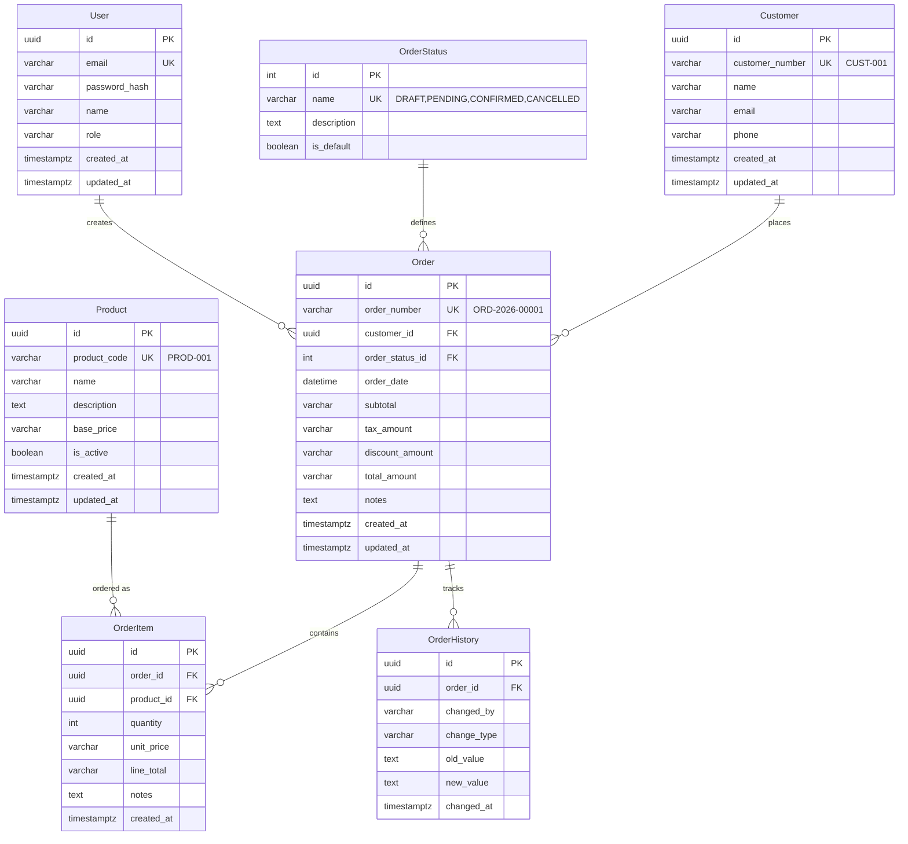

# Customer Order Management System
## Architecture Design Document

**Version**: 2.0 (Updated for Actual Implementation)
**Date**: July 7, 2026
**Authors**: System Architecture Team
**Status**: Current Implementation

---

## Table of Contents

1. [System Overview](#system-overview)
2. [Technology Stack](#technology-stack)
3. [Architecture Patterns](#architecture-patterns)
4. [Backend Architecture](#backend-architecture)
5. [Frontend Architecture](#frontend-architecture)
6. [Database Architecture](#database-architecture)
7. [API Architecture](#api-architecture)
8. [Security Architecture](#security-architecture)
9. [Deployment Architecture](#deployment-architecture)

---

## System Overview

### Purpose
Customer Order Management System is a web-based application built with **NestJS (Node.js)** backend and **React** frontend, designed to streamline sales operations by enabling efficient creation, search, and management of customer orders.

### Core Functionality
- **Order Creation**: Create customer orders with multiple products, quantities, and pricing
- **Order Search**: Search orders by Order ID, customer name/number, status, and date
- **Order Management**: Update orders, modify products, change status with audit trail
- **Authentication**: JWT-based authentication for internal staff
- **Role-Based Access**: Support for admin and sales executive roles

### System Boundary
```
┌─────────────────────────────────────────────────────────────┐
│                    Customer Order Management                    │
├─────────────────────────────────────────────────────────────┤
│  Frontend (React)    │    Backend (NestJS)    │   Database   │
│                      │                       │  (SQLite)      │
│  - User Interface    │  - REST API            │               │
│  - Form Validation   │  - Business Logic      │  - Orders     │
│  - State Management  │  - Authentication      │  - Customers  │
│  - HTTP Client       │  - Data Validation     │  - Products   │
│                      │  - Prisma ORM          │  - Users      │
└─────────────────────────────────────────────────────────────┘
```

---

## Technology Stack

### Backend Technologies

| Component | Technology | Purpose | Version |
|-----------|-----------|---------|---------|
| **Framework** | NestJS | Node.js framework with TypeScript | 10.x |
| **Language** | TypeScript 5 | Type-safe JavaScript | 5.x |
| **Runtime** | Node.js | JavaScript runtime | 20.x |
| **Database** | SQLite | Embedded database | 3.x |
| **ORM** | Prisma | Type-safe database ORM | 5.x |
| **Authentication** | Passport + JWT | Token-based authentication | Latest |
| **Validation** | class-validator | DTO validation | Latest |
| **API Docs** | Swagger | Auto-generated API documentation | Latest |

### Frontend Technologies

| Component | Technology | Purpose | Version |
|-----------|-----------|---------|---------|
| **Framework** | React 18 | UI framework | 18.2.x |
| **Language** | TypeScript 5 | Type-safe JavaScript | 5.3.x |
| **Build Tool** | Vite 5 | Fast development server | 5.x |
| **Routing** | React Router 6 | Client-side routing | 6.21.x |
| **HTTP Client** | Axios | API communication | 1.6.x |
| **Forms** | React Hook Form 7 | Form management | 7.49.x |
| **Validation** | Zod 3 | Schema validation | 3.22.x |
| **Styling** | Tailwind CSS 3 | Utility-first CSS | 3.4.x |
| **Date Handling** | date-fns 3 | Date manipulation | 3.x |

### Development Tools

| Tool | Purpose |
|------|---------|
| **ESLint** | Code linting |
| **Prettier** | Code formatting |
| **TypeScript** | Static type checking |
| **Git** | Version control |
| **Prisma Studio** | Database GUI |

---

## Architecture Patterns

### Overall Architecture
The system follows a **Three-Tier Architecture** with clear separation of concerns:

1. **Presentation Tier** (Frontend)
   - User interface and interaction
   - Client-side validation
   - State management with React Context API

2. **Application Tier** (Backend)
   - Business logic with NestJS modules
   - API endpoints with controllers
   - Authentication & authorization with Passport
   - Data validation with class-validator

3. **Data Tier** (Database)
   - SQLite with Prisma ORM
   - Data persistence and integrity
   - Transaction management

### Backend Architecture Pattern
**Modular Architecture** with NestJS:

```
┌─────────────────────────────────────┐
│         Controller Layer             │
│  - Routes/Endpoints                  │
│  - Request/Response handling         │
├─────────────────────────────────────┤
│       Service Layer                  │
│  - Business logic                    │
│  - Authentication service            │
├─────────────────────────────────────┤
│      Prisma Service Layer            │
│  - Data access operations            │
│  - Database queries                  │
├─────────────────────────────────────┤
│      Database (SQLite)               │
│  - Data storage                      │
│  - Prisma ORM mapping                │
└─────────────────────────────────────┘
```

### Frontend Architecture Pattern
**Component-Based Architecture** with React:

```
┌─────────────────────────────────────┐
│         Page Components             │
│  - Route-based pages                 │
│  - High-level UI components          │
├─────────────────────────────────────┤
│       Shared Components              │
│  - Reusable UI components            │
│  - Layout components                 │
├─────────────────────────────────────┤
│      Services & Hooks                │
│  - API service layer                  │
│  - Custom React hooks                │
├─────────────────────────────────────┤
│      Context & Types                 │
│  - Global state (AuthContext)         │
│  - TypeScript definitions            │
└─────────────────────────────────────┘
```

---

## Backend Architecture

### Project Structure
```
backend/
├── src/
│   ├── config/                  # Configuration
│   │   ├── config.module.ts
│   │   └── app.config.service.ts
│   ├── common/                  # Shared resources
│   │   ├── prisma.service.ts   # Prisma client
│   │   ├── prisma.module.ts
│   │   └── decorators/
│   │       └── current-user.decorator.ts
│   ├── modules/                 # Feature modules
│   │   ├── auth/              # Authentication module
│   │   │   ├── auth.controller.ts
│   │   │   ├── auth.service.ts
│   │   │   ├── auth.module.ts
│   │   │   ├── dto/
│   │   │   ├── strategies/
│   │   │   └── guards/
│   │   ├── customer/          # Customer module
│   │   ├── product/           # Product module
│   │   └── order/             # Order module
│   ├── app.module.ts          # Root module
│   └── main.ts                # Application entry
├── prisma/
│   ├── schema.prisma          # Database schema
│   └── seed.ts                # Seed data
└── package.json
```

### Key Components

#### 1. Auth Module (`modules/auth/`)
**Responsibility**: Authentication and authorization

**Components**:
- **Controller**: `/api/auth/login`, `/api/auth/profile` endpoints
- **Service**: User validation, JWT token generation
- **Strategies**: Passport Local and JWT strategies
- **Guards**: JWT authentication guard
- **DTOs**: Login request validation

**Authentication Flow**:
```typescript
POST /api/auth/login
{
  "email": "admin@example.com",
  "password": "Admin@123"
}
↓
AuthService.validateUser()
↓
Passport Local Strategy
↓
JWT Token Generation
↓
Response: { access_token, user }
```

#### 2. Customer Module (`modules/customer/`)
**Responsibility**: Customer CRUD operations

**Endpoints**:
- `POST /api/customers` - Create customer
- `GET /api/customers` - List all customers
- `GET /api/customers/:id` - Get customer by ID
- `PUT /api/customers/:id` - Update customer
- `DELETE /api/customers/:id` - Delete customer

#### 3. Product Module (`modules/product/`)
**Responsibility**: Product catalog management

**Endpoints**:
- `POST /api/products` - Create product
- `GET /api/products` - List all products
- `GET /api/products/:id` - Get product by ID
- `PUT /api/products/:id` - Update product
- `DELETE /api/products/:id` - Delete product

#### 4. Order Module (`modules/order/`)
**Responsibility**: Order management with full CRUD

**Endpoints**:
- `POST /api/orders` - Create order
- `GET /api/orders` - List orders with filters
- `GET /api/orders/:id` - Get order details
- `PUT /api/orders/:id` - Update order
- `DELETE /api/orders/:id` - Delete order

**Order Creation Flow**:
```typescript
POST /api/orders
{
  "customerId": "uuid",
  "orderDate": "2026-07-07",
  "taxAmount": 5000,
  "discountAmount": 2000,
  "items": [
    {
      "productId": "uuid",
      "quantity": 2,
      "unitPrice": 25000
    }
  ]
}
↓
OrderService.createOrder()
↓
Prisma transaction
↓
Create Order + OrderItems
↓
Response with order details
```

### Request Flow
```
HTTP Request
    ↓
Controller Route Handler
    ↓
DTO Validation (class-validator)
    ↓
Service Layer (Business Logic)
    ↓
Prisma Service (Data Access)
    ↓
Database (SQLite via Prisma)
    ↓
Response Processing
    ↓
HTTP Response
```

### Error Handling Strategy
**NestJS Built-in Exception Filters**:

1. **NotFoundException**: Resource not found (404)
2. **UnauthorizedException**: Authentication failed (401)
3. **ForbiddenException**: Authorization failed (403)
4. **BadRequestException**: Validation failed (400)
5. **ConflictException**: Resource conflict (409)

**Standard Error Response**:
```json
{
  "statusCode": 404,
  "message": "Order not found",
  "error": "Not Found"
}
```

---

## Frontend Architecture

### Project Structure
```
frontend/
├── src/
│   ├── components/              # Reusable components
│   │   └── Layout.tsx          # Main layout component
│   ├── context/                # React Context
│   │   └── AuthContext.tsx    # Authentication context
│   ├── hooks/                  # Custom React hooks
│   │   └── useAuth.ts         # Authentication hook
│   ├── pages/                  # Page components
│   │   ├── Dashboard.tsx      # Main dashboard
│   │   ├── OrderList.tsx      # Order list
│   │   ├── OrderCreate.tsx    # Order creation
│   │   ├── OrderDetail.tsx    # Order details (redesigned)
│   │   └── LoginPage.tsx      # Login page
│   ├── services/               # API communication
│   │   ├── api.ts             # Axios client setup
│   │   ├── authService.ts     # Auth API calls
│   │   ├── orderService.ts    # Order API calls
│   │   ├── customerService.ts # Customer API calls
│   │   └── productService.ts  # Product API calls
│   ├── types/                  # TypeScript definitions
│   │   └── index.ts           # All type definitions
│   ├── App.tsx                # Root component
│   └── main.tsx               # Application entry
├── public/                     # Static assets
├── index.html
├── vite.config.ts            # Vite configuration
├── tailwind.config.js        # Tailwind configuration
└── package.json
```

### Key Components

#### 1. Service Layer (`src/services/`)
**Responsibility**: API communication

**API Client Setup**:
```typescript
// api.ts - Base API client
const apiClient = axios.create({
  baseURL: '/api',  // Uses Vite proxy
  timeout: 10000,
  headers: {
    'Content-Type': 'application/json',
  },
});

// Request interceptor - Add auth token
apiClient.interceptors.request.use((config) => {
  const token = localStorage.getItem('access_token');
  if (token) {
    config.headers.Authorization = `Bearer ${token}`;
  }
  return config;
});

// Response interceptor - Handle 401
apiClient.interceptors.response.use(
  (response) => response,
  (error) => {
    if (error.response?.status === 401) {
      localStorage.removeItem('access_token');
      localStorage.removeItem('user');
      window.location.href = '/login';
    }
    return Promise.reject(error);
  }
);
```

#### 2. Authentication Context (`src/context/AuthContext.tsx`)
**Responsibility**: Global authentication state

**Features**:
- User state management
- Token storage in localStorage
- Login/logout functions
- Automatic token restoration on page load

#### 3. Page Components (`src/pages/`)
**Recently Redesigned**: `OrderDetail.tsx`

**New Order Detail Features**:
- Status timeline visualization
- Clean card-based layout
- Customer information card
- Activity timeline
- Enhanced order items display
- Mobile-responsive design

### State Management Strategy
**React Context API** approach:

1. **AuthContext**: Global authentication state
2. **Local Component State**: Form data, UI state
3. **Server State**: API data with direct fetching (no additional library for MVP)

### Routing Structure
```typescript
// App.tsx
<Routes>
  <Route path="/login" element={<LoginPage />} />
  <Route path="/" element={<ProtectedRoute />}>
    <Route index element={<Dashboard />} />
    <Route path="orders" element={<OrderList />} />
    <Route path="orders/create" element={<OrderCreate />} />
    <Route path="orders/:id" element={<OrderDetail />} />
  </Route>
</Routes>
```

---

## Database Architecture

### Database Technology
**SQLite** with **Prisma ORM**

### Database Design Principles
- **3NF Normalization**: Proper table relationships
- **UUID Primary Keys**: Distributed system compatibility
- **Readable Foreign IDs**: User-friendly order numbers
- **Complete Audit Trail**: Order history tracking
- **Referential Integrity**: Foreign key constraints

### Schema Overview

#### Entity Relationship Diagram


### Core Tables

#### User Table (Authentication)
```prisma
model User {
  id           String    @id @default(uuid())
  email        String    @unique
  passwordHash String    @map("password_hash")
  name         String
  role         String    @default("sales_executive")
  createdAt    DateTime  @default(now()) @map("created_at")
  updatedAt    DateTime  @updatedAt @map("updated_at")

  @@map("user")
}
```

#### Order Status Table (Lookup)
```prisma
model OrderStatus {
  id          Int      @id @default(autoincrement())
  name        String   @unique
  description String?
  isDefault   Boolean  @default(false) @map("is_default")
  orders      Order[]

  @@map("order_status")
}
```

#### Order Table
```prisma
model Order {
  id             String       @id @default(uuid())
  orderNumber    String       @unique @map("order_number")
  customerId     String       @map("customer_id")
  orderStatusId  Int          @default(1) @map("order_status_id")
  orderDate      DateTime     @default(now()) @map("order_date")
  subtotal       String       @default("0.00")
  taxAmount      String       @default("0.00") @map("tax_amount")
  discountAmount String       @default("0.00") @map("discount_amount")
  totalAmount    String       @default("0.00") @map("total_amount")
  notes          String?
  createdAt      DateTime     @default(now()) @map("created_at")
  updatedAt      DateTime     @updatedAt @map("updated_at")

  customer  Customer        @relation(fields: [customerId], references: [id])
  status    OrderStatus     @relation(fields: [orderStatusId], references: [id])
  items     OrderItem[]
  history   OrderHistory[]

  @@map("order")
}
```

### Prisma Service
**Singleton Prisma Client**:
```typescript
@Injectable()
export class PrismaService extends PrismaClient {
  constructor() {
    super({
      datasources: {
        db: {
          url: process.env.DATABASE_URL,
        },
      },
    });
  }

  async onModuleInit() {
    await this.$connect();
  }

  async onModuleDestroy() {
    await this.$disconnect();
  }
}
```

---

## API Architecture

### RESTful API Design
**Base URL**: `http://localhost:3000/api`

### Core Endpoints

#### Authentication Endpoints
```
POST   /api/auth/login          - User login
GET    /api/auth/profile        - Get current user profile
```

#### Order Endpoints
```
GET    /api/orders              - List orders with filters
POST   /api/orders              - Create new order
GET    /api/orders/:id          - Get order details
PUT    /api/orders/:id          - Update order
DELETE /api/orders/:id          - Delete order
```

#### Customer Endpoints
```
GET    /api/customers           - List customers
POST   /api/customers           - Create customer
GET    /api/customers/:id       - Get customer details
PUT    /api/customers/:id       - Update customer
DELETE /api/customers/:id       - Delete customer
```

#### Product Endpoints
```
GET    /api/products            - List products
POST   /api/products            - Create product
GET    /api/products/:id        - Get product details
PUT    /api/products/:id        - Update product
DELETE /api/products/:id        - Delete product
```

### Request/Response Patterns

#### Authentication Flow
```typescript
// Login Request
POST /api/auth/login
{
  "email": "admin@example.com",
  "password": "Admin@123"
}

// Login Response
{
  "access_token": "eyJhbGciOiJIUzI1NiIsInR5cCI6IkpXVCJ9...",
  "user": {
    "id": "uuid",
    "email": "admin@example.com",
    "name": "Admin User",
    "role": "admin"
  }
}
```

#### Order Creation Pattern
```typescript
// Create Order Request
POST /api/orders
{
  "customerId": "uuid",
  "orderDate": "2026-07-07",
  "taxAmount": "5000.00",
  "discountAmount": "2000.00",
  "items": [
    {
      "productId": "uuid",
      "quantity": 2,
      "unitPrice": "25000.00",
      "notes": "Custom configuration"
    }
  ]
}

// Create Order Response
{
  "id": "uuid",
  "orderNumber": "ORD-2026-00011",
  "customerId": "uuid",
  "totalAmount": "53000.00",
  "orderStatusId": 1,
  "items": [...],
  "createdAt": "2026-07-07T10:30:00Z"
}
```

### API Documentation
**Swagger/OpenAPI Documentation**:
- **Swagger UI**: `http://localhost:3000/api/docs`
- **Auto-generated** from NestJS decorators
- **Bearer Auth** configuration included

---

## Security Architecture

### Authentication Strategy
**JWT-Based Authentication** with Passport:

1. **Access Token**: Long-lived JWT (configurable expiration)
   - Contains user claims (id, email, name, role)
   - Stored in localStorage
   - Sent in Authorization header

### Token Structure
**Access Token Payload**:
```json
{
  "sub": "user-uuid",
  "email": "admin@example.com",
  "name": "Admin User",
  "role": "admin",
  "iat": 1688346300,
  "exp": 1688432700
}
```

### Authorization Strategy
**Role-Based Access Control (RBAC)**:

**Roles**:
- `admin`: Full system access
- `sales_executive`: Order management (default)

**Current Implementation**:
- Authentication required for all API routes
- JWT guard protects endpoints
- Role field exists but no role-specific guards implemented yet

**Planned Enhancements**:
- Role guards for admin-only operations
- Permission decorators for fine-grained control

### Security Measures

#### 1. Input Validation
- **class-validator**: DTO validation
- **class-transformer**: Data transformation
- **ValidationPipe**: Global validation pipe

#### 2. CORS Configuration
```typescript
// Development: All origins allowed
// Production: Configured whitelist
if (process.env.NODE_ENV === 'development') {
  app.enableCors({ origin: '*', credentials: false });
}
```

#### 3. Password Security
- **Hashing**: bcrypt (cost factor: 10)
- **Requirements**: Min 8 characters
- **Storage**: Hash only, never plain text

#### 4. JWT Strategy
- **Algorithm**: HS256
- **Secret**: Environment variable
- **Expiration**: Configurable

### Audit Trail
**Order History Tracking**:
- Created: New order insertion
- Updated: Order modification
- Status Changed: Status transitions

**Audit Record**:
```typescript
{
  order_id: "uuid",
  change_type: "STATUS_CHANGED",
  old_value: "{ \"status_id\": 1 }",
  new_value: "{ \"status_id\": 2 }",
  changed_at: "2026-07-07T10:30:00Z"
}
```

---

## Deployment Architecture

### Development Environment
**Local Development Setup**:

```
┌─────────────────────────────────────┐
│      Developer Workstation          │
├─────────────────────────────────────┤
│  Frontend (Vite)                    │
│  - http://localhost:5173            │
│  - Hot Module Replacement            │
│  - TypeScript checking               │
├─────────────────────────────────────┤
│  Backend (NestJS)                   │
│  - http://localhost:3000            │
│  - Auto-reload on code changes      │
│  - Debug mode                       │
├─────────────────────────────────────┤
│  Database (SQLite)                  │
│  - prisma/dev.db                    │
│  - Prisma Studio (optional)         │
└─────────────────────────────────────┘
```

### Running the Application

**Backend**:
```bash
cd backend
npm install
npx prisma generate
npx prisma migrate dev
npx prisma db seed  # Create admin user
npm run start:dev   # Runs on http://localhost:3000
```

**Frontend**:
```bash
cd frontend
npm install
npm run dev         # Runs on http://localhost:5173
```

### Environment Configuration

**Backend (.env)**:
```bash
# Database
DATABASE_URL="file:./dev.db"

# JWT
JWT_SECRET="your-secret-key-here"
JWT_EXPIRATION="7d"

# CORS
FRONTEND_URL="http://localhost:5173"

# Application
PORT=3000
NODE_ENV="development"
```

**Frontend (.env)**:
```bash
VITE_API_URL=http://localhost:3000/api
VITE_APP_NAME=Customer Order Management
```

### Prisma Configuration

**Database Schema** (`prisma/schema.prisma`):
```prisma
datasource db {
  provider = "sqlite"
  url      = env("DATABASE_URL")
}

generator client {
  provider = "prisma-client-js"
}
```

---

## Future Enhancements

### V2 Features
1. **Role-Based Access Control Guards**
   - Admin-only endpoints
   - Permission decorators
   - Fine-grained authorization

2. **Customer Portal**
   - Customer authentication
   - Order tracking for customers
   - Customer dashboard

3. **Advanced Search**
   - Full-text search
   - Multi-field filters
   - Saved searches

4. **Order Status Workflow**
   - Status transition rules
   - Email notifications
   - Approval workflow

### V3 Features
1. **Database Migration**
   - PostgreSQL support
   - Better for production
   - Enhanced query capabilities

2. **Real-time Updates**
   - WebSocket support
   - Live order status
   - Collaborative features

3. **Analytics Dashboard**
   - Sales trends
   - Customer insights
   - Performance metrics

---

## Document Control

| Field | Value |
|-------|-------|
| Document Name | Customer Order Management - Architecture Design |
| Version | 2.0 (Updated) |
| Authors | System Architecture Team |
| Date | July 7, 2026 |
| Status | Current Implementation |
| Next Review | October 2026 |

---

## Change History

| Version | Date | Author | Changes |
|---------|------|--------|---------|
| 2.0 | 2026-07-07 | Architecture Team | Updated to reflect actual NestJS/TypeScript implementation |
| 1.0 | 2026-07-02 | Architecture Team | Initial version (planned FastAPI stack) |

---

© 2026 Customer Order Management System. All rights reserved.
