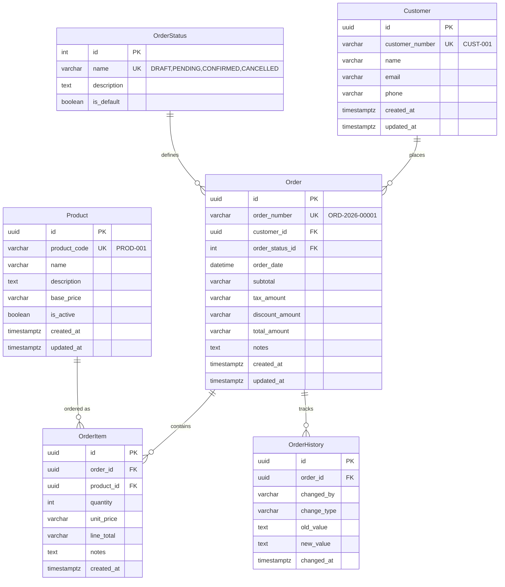

# Customer Order Management MVP
## Data Model Document

**Version**: 2.0 (Updated for Prisma/SQLite)
**Date**: July 7, 2026
**Database**: SQLite 3+
**ORM**: Prisma 5.x

---

## Table of Contents

1. [Overview](#overview)
2. [Entity Relationship Diagram](#entity-relationship-diagram)
3. [Data Dictionary](#data-dictionary)
4. [Relationships](#relationships)
5. [Prisma Schema](#prisma-schema)
6. [Sample Data](#sample-data)
7. [Seed Data](#seed-data)

---

## Overview

### Business Domain
Sales Operations - Customer Order Management

### Core Workflows
| Workflow | Description |
|----------|-------------|
| Order Create | Create orders with customer details, products, quantities, and pricing |
| Order Search | Search by Order ID, Customer Name, Customer Number, Status, Date |
| Order Update | Edit orders, modify products, update status with history tracking |

### Primary Actor
**Rahul Sharma** - Sales Executive who creates, searches, and updates orders daily

### Design Principles
- Third Normal Form (3NF)
- UUID primary keys for distributed systems
- User-friendly readable IDs (ORD-2026-00001, CUST-001)
- Complete audit trail
- Future-proof for V2/V3 features

---

## Entity Relationship Diagram



---

## Data Dictionary

### customer
Stores customer information for order management.

| Column | Type | Nullable | Default | Description |
|--------|------|----------|---------|-------------|
| id | UUID | ❌ | uuid_generate_v4() | Primary key |
| customer_number | VARCHAR(50) | ❌ | - | User-facing ID (e.g., CUST-001) |
| name | VARCHAR(255) | ❌ | - | Customer full name |
| email | VARCHAR(255) | ✅ | NULL | Email contact |
| phone | VARCHAR(50) | ✅ | NULL | Phone contact |
| created_at | TIMESTAMPTZ | ❌ | NOW() | Creation timestamp |
| updated_at | TIMESTAMPTZ | ❌ | NOW() | Last update timestamp |

**Constraints:**
- PRIMARY KEY: id
- UNIQUE: customer_number

**Relationships:**
- HAS MANY: Order

---

### product
Product catalog for order items.

| Column | Type | Nullable | Default | Description |
|--------|------|----------|---------|-------------|
| id | UUID | ❌ | uuid_generate_v4() | Primary key |
| product_code | VARCHAR(50) | ❌ | - | User-facing ID (e.g., PROD-001) |
| name | VARCHAR(255) | ❌ | - | Product name |
| description | TEXT | ✅ | NULL | Product description |
| base_price | VARCHAR(100) | ❌ | "0.00" | Reference price |
| is_active | BOOLEAN | ❌ | TRUE | Product availability |
| created_at | TIMESTAMPTZ | ❌ | NOW() | Creation timestamp |
| updated_at | TIMESTAMPTZ | ❌ | NOW() | Last update timestamp |

**Constraints:**
- PRIMARY KEY: id
- UNIQUE: product_code

**Relationships:**
- HAS MANY: OrderItem

---

### order_status
Lookup table for order statuses.

| Column | Type | Nullable | Default | Description |
|--------|------|----------|---------|-------------|
| id | INTEGER | ❌ | Auto-increment | Primary key |
| name | VARCHAR(50) | ❌ | - | Status name |
| description | TEXT | ✅ | NULL | Status description |
| is_default | BOOLEAN | ❌ | FALSE | Default for new orders |

**Constraints:**
- PRIMARY KEY: id
- UNIQUE: name

**Initial Data:**
| id | name | description | is_default |
|----|------|-------------|-------------|
| 1 | DRAFT | Order being created | TRUE |
| 2 | PENDING | Awaiting confirmation | FALSE |
| 3 | CONFIRMED | Order confirmed and active | FALSE |
| 4 | CANCELLED | Order cancelled | FALSE |

**Relationships:**
- HAS MANY: Order

---

### order
Core order entity.

| Column | Type | Nullable | Default | Description |
|--------|------|----------|---------|-------------|
| id | UUID | ❌ | uuid_generate_v4() | Primary key |
| order_number | VARCHAR(50) | ❌ | - | User-facing ID (e.g., ORD-2026-00001) |
| customer_id | UUID | ❌ | - | Foreign key to customer |
| order_status_id | INTEGER | ❌ | 1 (DRAFT) | Foreign key to order_status |
| order_date | DATETIME | ❌ | NOW() | Order date |
| subtotal | VARCHAR(100) | ❌ | "0.00" | Sum of line items |
| tax_amount | VARCHAR(100) | ❌ | "0.00" | Tax calculation |
| discount_amount | VARCHAR(100) | ❌ | "0.00" | Discounts applied |
| total_amount | VARCHAR(100) | ❌ | "0.00" | Final total |
| notes | TEXT | ✅ | NULL | Order notes |
| created_at | TIMESTAMPTZ | ❌ | NOW() | Creation timestamp |
| updated_at | TIMESTAMPTZ | ❌ | NOW() | Last update timestamp |

**Constraints:**
- PRIMARY KEY: id
- UNIQUE: order_number
- FOREIGN KEY: customer_id → customer(id) ON DELETE RESTRICT
- FOREIGN KEY: order_status_id → order_status(id) ON DELETE RESTRICT

**Relationships:**
- BELONGS TO: Customer
- BELONGS TO: OrderStatus
- HAS MANY: OrderItem
- HAS MANY: OrderHistory

---

### order_item
Line items for orders.

| Column | Type | Nullable | Default | Description |
|--------|------|----------|---------|-------------|
| id | UUID | ❌ | uuid_generate_v4() | Primary key |
| order_id | UUID | ❌ | - | Foreign key to order |
| product_id | UUID | ❌ | - | Foreign key to product |
| quantity | INTEGER | ❌ | 1 | Number of units |
| unit_price | VARCHAR(100) | ❌ | "0.00" | Price at time of order |
| line_total | VARCHAR(100) | ❌ | "0.00" | quantity × unit_price |
| notes | TEXT | ✅ | NULL | Line item notes |
| created_at | TIMESTAMPTZ | ❌ | NOW() | Creation timestamp |

**Constraints:**
- PRIMARY KEY: id
- FOREIGN KEY: order_id → order(id) ON DELETE CASCADE
- FOREIGN KEY: product_id → product(id) ON DELETE RESTRICT

**Relationships:**
- BELONGS TO: Order
- BELONGS TO: Product

---

### order_history
Audit trail for order changes.

| Column | Type | Nullable | Default | Description |
|--------|------|----------|---------|-------------|
| id | UUID | ❌ | uuid_generate_v4() | Primary key |
| order_id | UUID | ❌ | - | Foreign key to order |
| changed_by | VARCHAR(255) | ✅ | NULL | User who made change |
| change_type | VARCHAR(50) | ❌ | - | Type: CREATED, UPDATED, STATUS_CHANGED |
| old_value | TEXT | ✅ | NULL | Previous state (JSON) |
| new_value | TEXT | ✅ | NULL | New state (JSON) |
| changed_at | TIMESTAMPTZ | ❌ | NOW() | Timestamp of change |

**Constraints:**
- PRIMARY KEY: id
- FOREIGN KEY: order_id → order(id) ON DELETE CASCADE

**Relationships:**
- BELONGS TO: Order

---

### user
Authentication users.

| Column | Type | Nullable | Default | Description |
|--------|------|----------|---------|-------------|
| id | UUID | ❌ | uuid_generate_v4() | Primary key |
| email | VARCHAR(255) | ❌ | - | User email (unique) |
| password_hash | VARCHAR(255) | ❌ | - | Bcrypt password hash |
| name | VARCHAR(255) | ❌ | - | User full name |
| role | VARCHAR(50) | ❌ | sales_executive | User role |
| created_at | TIMESTAMPTZ | ❌ | NOW() | Creation timestamp |
| updated_at | TIMESTAMPTZ | ❌ | NOW() | Last update timestamp |

**Constraints:**
- PRIMARY KEY: id
- UNIQUE: email

**Roles:**
- `admin` - Full system access
- `sales_executive` - Order management (default)

---

## Relationships

### Relationship Details

| From | To | Cardinality | Optionality | Cascade |
|------|----|-------------|-------------|---------|
| Customer | Order | 1:N | Mandatory | RESTRICT |
| OrderStatus | Order | 1:N | Mandatory | RESTRICT |
| Order | OrderItem | 1:N | Mandatory | CASCADE |
| Product | OrderItem | 1:N | Mandatory | RESTRICT |
| Order | OrderHistory | 1:N | Mandatory | CASCADE |

### Cascade Behavior

| Behavior | Tables | Reason |
|----------|--------|--------|
| CASCADE | Order → OrderItem | Items cannot exist without order |
| CASCADE | Order → OrderHistory | History attached to order lifecycle |
| RESTRICT | Customer → Order | Cannot delete customer with orders |
| RESTRICT | Product → OrderItem | Cannot delete product referenced in orders |

---

## Prisma Schema

```prisma
// This is your Prisma schema file,
// learn more about it in the docs: https://pris.ly/d/prisma-schema

generator client {
  provider = "prisma-client-js"
}

datasource db {
  provider = "sqlite"
  url      = env("DATABASE_URL")
}

// User model for authentication
model User {
  id           String    @id @default(uuid())
  email        String    @unique
  passwordHash String    @map("password_hash")
  name         String
  role         String    @default("sales_executive")
  createdAt    DateTime  @default(now()) @map("created_at")
  updatedAt    DateTime  @updatedAt @map("updated_at")

  @@map("user")
}

// Customer model
model Customer {
  id             String    @id @default(uuid())
  customerNumber String    @unique @map("customer_number")
  name           String
  email          String?
  phone          String?
  createdAt      DateTime  @default(now()) @map("created_at")
  updatedAt      DateTime  @updatedAt @map("updated_at")

  orders         Order[]

  @@map("customer")
}

// Product model
model Product {
  id           String    @id @default(uuid())
  productCode  String    @unique @map("product_code")
  name         String
  description  String?
  basePrice    String    @default("0.00") @map("base_price")
  isActive     Boolean   @default(true) @map("is_active")
  createdAt    DateTime  @default(now()) @map("created_at")
  updatedAt    DateTime  @updatedAt @map("updated_at")

  orderItems   OrderItem[]

  @@map("product")
}

// Order status lookup table
model OrderStatus {
  id          Int      @id @default(autoincrement())
  name        String   @unique
  description String?
  isDefault   Boolean  @default(false) @map("is_default")

  orders      Order[]

  @@map("order_status")
}

// Order model
model Order {
  id             String      @id @default(uuid())
  orderNumber    String      @unique @map("order_number")
  customerId     String      @map("customer_id")
  orderStatusId  Int         @default(1) @map("order_status_id")
  orderDate      DateTime    @default(now()) @map("order_date")
  subtotal       String      @default("0.00")
  taxAmount      String      @default("0.00") @map("tax_amount")
  discountAmount String      @default("0.00") @map("discount_amount")
  totalAmount    String      @default("0.00") @map("total_amount")
  notes          String?
  createdAt      DateTime    @default(now()) @map("created_at")
  updatedAt      DateTime    @updatedAt @map("updated_at")

  customer        Customer    @relation(fields: [customerId], references: [id])
  status          OrderStatus @relation(fields: [orderStatusId], references: [id])
  items           OrderItem[]
  history         OrderHistory[]

  @@map("order")
}

// Order item model
model OrderItem {
  id         String    @id @default(uuid())
  orderId    String    @map("order_id")
  productId  String    @map("product_id")
  quantity   Int       @default(1)
  unitPrice  String   @default("0.00") @map("unit_price")
  lineTotal  String   @default("0.00") @map("line_total")
  notes      String?
  createdAt  DateTime  @default(now()) @map("created_at")

  order      Order     @relation(fields: [orderId], references: [id], onDelete: Cascade)
  product    Product   @relation(fields: [productId], references: [id])

  @@map("order_item")
}

// Order history for audit trail
model OrderHistory {
  id         String    @id @default(uuid())
  orderId    String    @map("order_id")
  changedBy  String?   @map("changed_by")
  changeType String    @map("change_type")
  oldValue   String?   @map("old_value")
  newValue   String?   @map("new_value")
  changedAt  DateTime  @default(now()) @map("changed_at")

  order      Order     @relation(fields: [orderId], references: [id], onDelete: Cascade)

  @@map("order_history")
}
```

---

## Sample Data

### Customers (5)

| customer_number | name | email | phone |
|-----------------|------|-------|-------|
| CUST-001 | Rahul Sharma | rahul.sharma@example.com | +91-98765-43210 |
| CUST-002 | Priya Patel | priya.patel@techcorp.in | +91-98765-43211 |
| CUST-003 | Amit Kumar Enterprises | amit@amitkumar.com | +91-98765-43212 |
| CUST-004 | Sneha Reddy | sneha.reddy@gmail.com | +91-98765-43213 |
| CUST-005 | Vikram Singh | vikram.singh@logistics.co.in | +91-98765-43214 |

### Products (8)

| product_code | name | base_price |
|--------------|------|------------|
| PROD-001 | Enterprise Software License | 50000.00 |
| PROD-002 | Cloud Storage - 1TB | 2000.00 |
| PROD-003 | Technical Support Package | 25000.00 |
| PROD-004 | Onboarding Service | 15000.00 |
| PROD-005 | API Integration Add-on | 10000.00 |
| PROD-006 | Mobile App License | 12000.00 |
| PROD-007 | Analytics Dashboard | 18000.00 |
| PROD-008 | Security Suite | 22000.00 |

### Users (Seeded)

| Email | Name | Role |
|-------|------|------|
| admin@example.com | Admin User | admin |

**Default Password**: `Admin@123`

---

## Seed Data

The seed file (`prisma/seed.ts`) creates:

1. **Order Statuses** (4 records)
   - DRAFT (default)
   - PENDING
   - CONFIRMED
   - CANCELLED

2. **Customers** (5 records)
   - Rahul Sharma (CUST-001)
   - Priya Patel (CUST-002)
   - Amit Kumar Enterprises (CUST-003)
   - Sneha Reddy (CUST-004)
   - Vikram Singh (CUST-005)

3. **Products** (8 records)
   - Enterprise Software License (PROD-001)
   - Cloud Storage - 1TB (PROD-002)
   - Technical Support Package (PROD-003)
   - Onboarding Service (PROD-004)
   - API Integration Add-on (PROD-005)
   - Mobile App License (PROD-006)
   - Analytics Dashboard (PROD-007)
   - Security Suite (PROD-008)

4. **Admin User** (1 record)
   - Email: admin@example.com
   - Password: Admin@123 (bcrypt hashed)
   - Role: admin

5. **Sample Orders** (2 records)
   - ORD-2026-00001: Rahul Sharma, CONFIRMED, ₹52,000
   - ORD-2026-00002: Priya Patel, PENDING, ₹25,000

---

## Database Operations

### Running Migrations
```bash
cd backend
npx prisma migrate dev
```

### Generating Prisma Client
```bash
npx prisma generate
```

### Seeding Database
```bash
npx prisma db seed
```

### Opening Prisma Studio
```bash
npx prisma studio
```

---

## Document Control

| Field | Value |
|-------|-------|
| Document Name | Customer Order Management MVP - Data Model |
| Version | 2.0 |
| Date | July 7, 2026 |
| Status | Current Implementation |

---

## Change History

| Version | Date | Changes |
|---------|------|---------|
| 2.0 | 2026-07-07 | Updated for Prisma/SQLite implementation |
| 1.0 | 2026-07-02 | Initial PostgreSQL version |

---

© 2026 Customer Order Management. All rights reserved.
