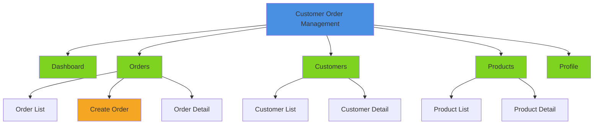
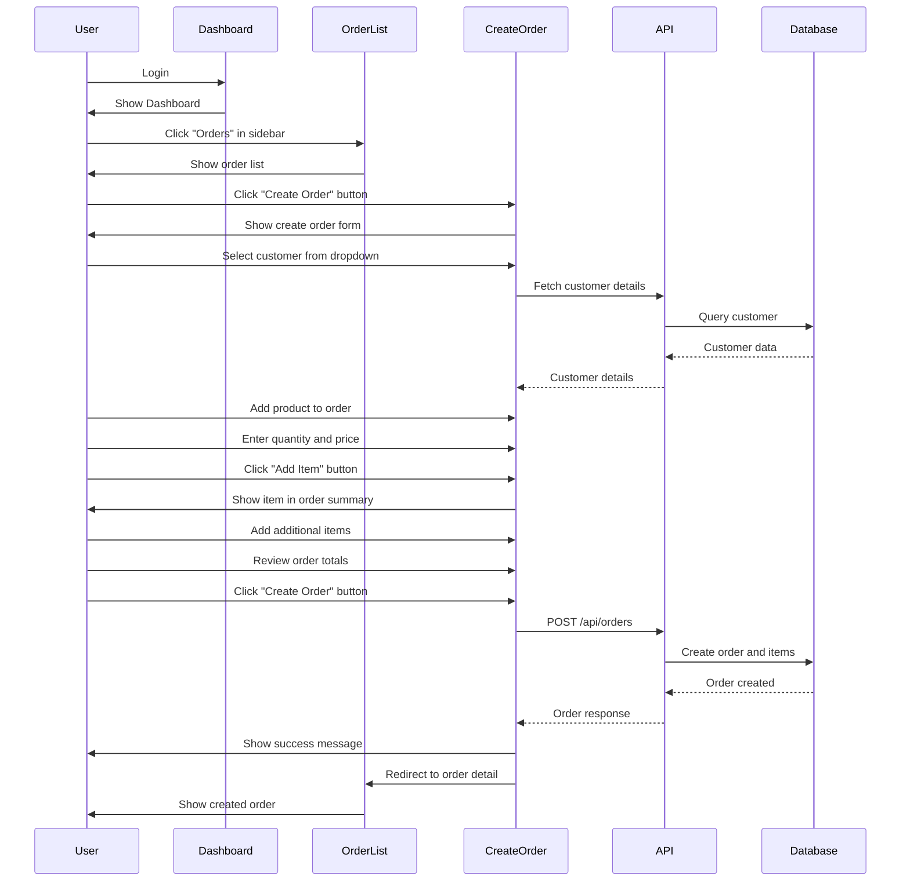
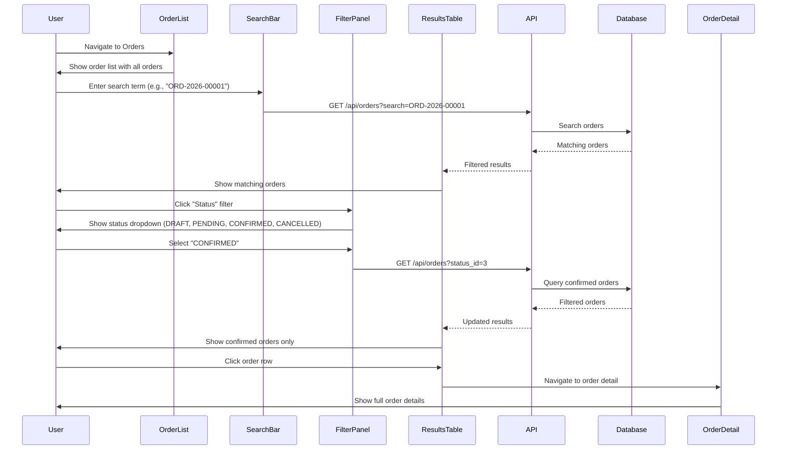
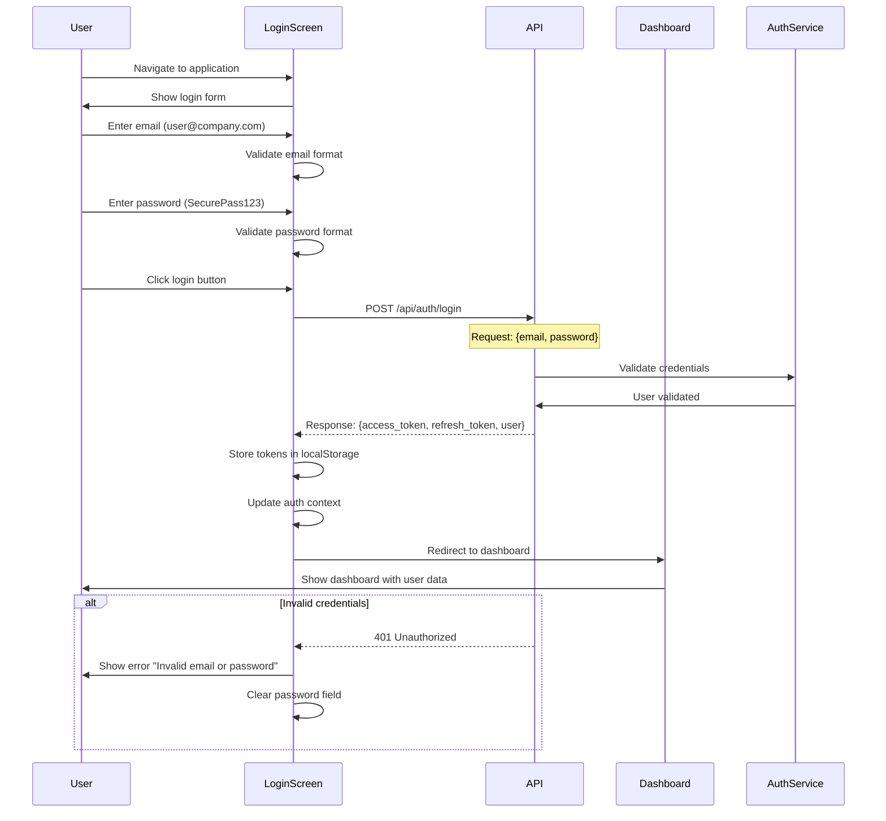
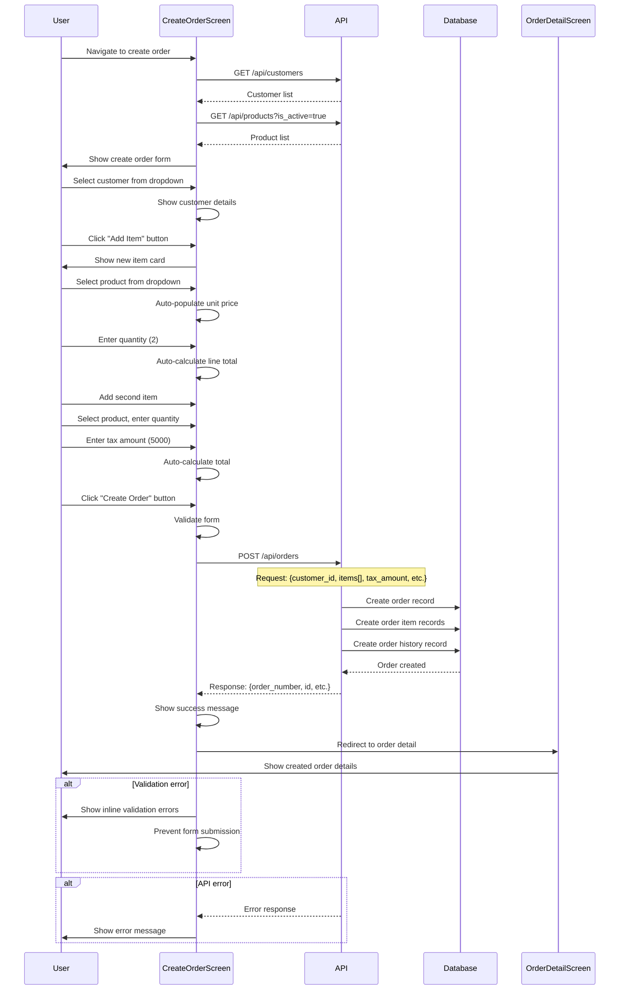
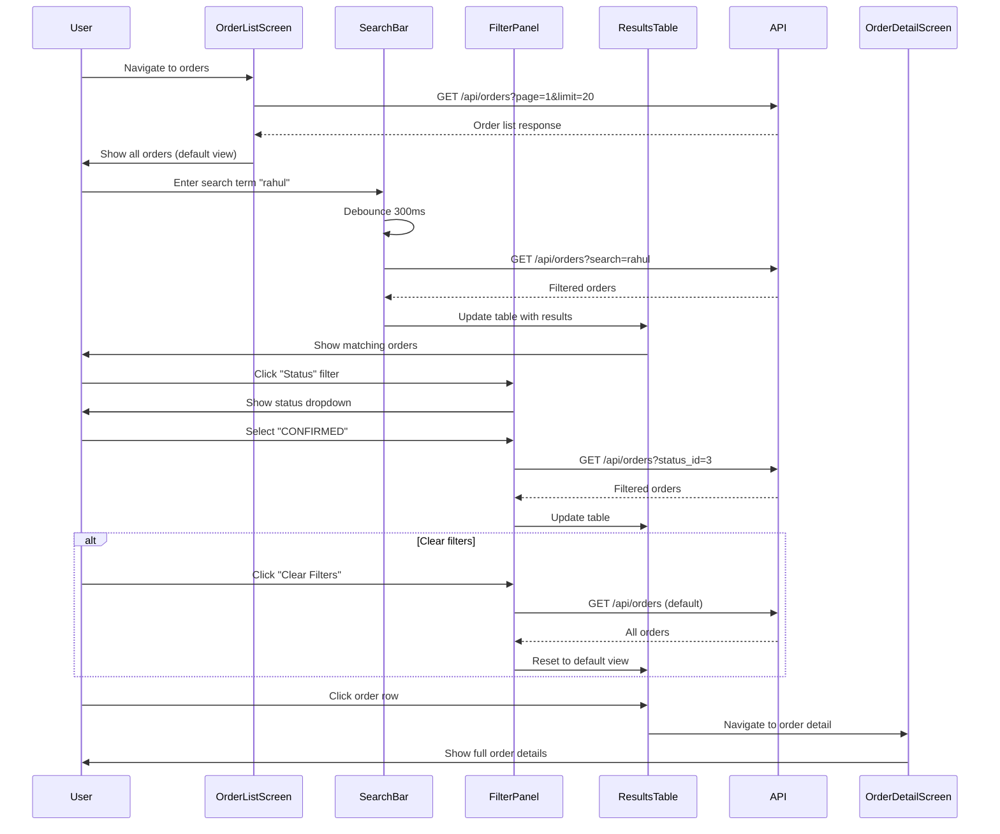
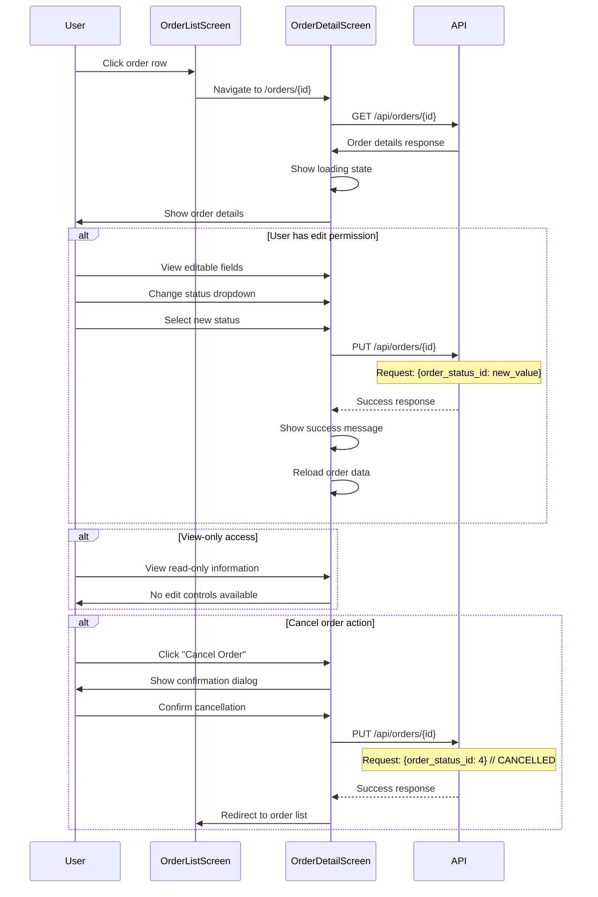
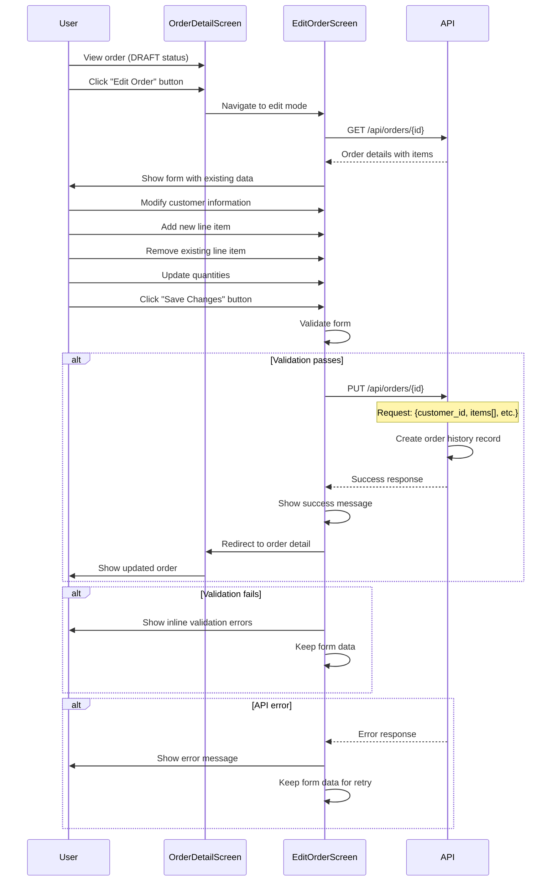

# Customer Order Management System
## Design Document

**Version**: 1.0
**Date**: July 2, 2026
**Project**: Customer Order Management MVP
**Authors**: Product Design Team

---

## Document Purpose

This Design Document provides comprehensive implementation guidance for the Customer Order Management MVP, serving as the single source of truth for UI designers, frontend developers, backend developers, QA engineers, and product managers.

---

# 1. Executive Summary

## Product Vision

Customer Order Management System exists to make order processing **simple, accurate, and efficient** for sales teams. By centralizing order creation, search, and updates into a single streamlined workflow, the system helps sales executives spend less time managing records and more time serving customers.

## Design Philosophy

### Core Design Tenets

1. **Efficiency First**: Every interaction is optimized for speed - sales executives need to process orders quickly without friction.
2. **Error Prevention**: Design prevents mistakes rather than catching them - validation, constraints, and smart defaults.
3. **Immediate Visibility**: Critical information is always visible - order status, customer details, and totals at a glance.
4. **Simplicity**: Complex tasks are broken into simple, clear steps - no overwhelming interfaces.
5. **Reliability**: System works consistently - predictable behavior, clear feedback, no surprises.

## Target Users

### Primary Persona: Rahul Sharma, Sales Executive

**Demographics**:
- **Role**: Sales Executive
- **Experience**: 5 years in sales
- **Technical Comfort**: Moderate - uses CRM systems daily
- **Work Environment**: Fast-paced office, multiple simultaneous customers

**Behaviors & Goals**:
- Creates 3-5 orders per day
- Searches for existing orders 10+ times per day
- Updates order details 2-3 times per day
- Needs to recall order details during customer calls
- Values speed and accuracy over complex features

**Frustrations** (Current Process):
- Manual record keeping in spreadsheets
- Slow order lookup process
- Duplicate data entry
- Inconsistent order information
- No audit trail for changes

**Success Criteria**:
- Create order in under 2 minutes
- Find any order in under 10 seconds
- Update orders without errors
- Trust that order information is accurate

### Secondary Users (Future)

**Sales Managers** (V2):
- Review team orders
- Approve large orders
- Access sales analytics

**System Administrators** (Future):
- Manage products and pricing
- Configure business rules
- Monitor system health

## Primary Workflows

### 1. Order Creation Workflow
```
User Action → Select Customer → Add Products → Review → Save
    ↓           ↓                 ↓            ↓       ↓
  Login      Customer         Product      Order      Confirmation
            Dropdown         Selection    Summary    Message
```

### 2. Order Search Workflow
```
User Action → Enter Search → View Results → Select Order → View Details
    ↓            ↓              ↓              ↓              ↓
  Dashboard    Search Bar    Order List    Order Row      Detail View
              Filter        Table         Click          Screen
              Options
```

### 3. Order Update Workflow
```
User Action → Find Order → Edit Details → Save Changes → Confirmation
    ↓            ↓            ↓              ↓               ↓
  Search/      Order        Edit Form     Validation     Success
  Navigate     Detail       Modified      & Save         Message
              Page
```

---

# 2. Design Principles

## Simplicity

### Progressively Disclose Information
- **Primary Action**: Always visible and obvious (e.g., "Create Order" button)
- **Secondary Actions**: Available but not distracting (e.g., "Export", "Print")
- **Advanced Features**: Hidden behind menus or icons (e.g., "Bulk Actions", "Advanced Search")

### Minimize Cognitive Load
- **Group Related Items**: Customer info together, product details together, totals together
- **Clear Visual Hierarchy**: Size, color, and position indicate importance
- **Consistent Patterns**: Same interaction patterns across all screens

### Reduce Decision Fatigue
- **Smart Defaults**: Auto-populate common values (today's date, current user, active products)
- **Contextual Suggestions**: Suggest customers, products based on usage patterns
- **Clear Next Steps**: Always show what to do next (e.g., "Add Item", "Save Order")

## Consistency

### Visual Consistency
- **Same Button = Same Meaning**: Primary button always confirms actions
- **Color Language**: Blue = action, Green = success, Red = danger, Orange = warning
- **Spacing Rhythm**: 8px grid system throughout the interface

### Interaction Consistency
- **Same Interaction, Same Result**: Click always activates, right-click always shows context menu
- **Predictable Behavior**: Forms validate the same way, tables sort the same way
- **Standard Patterns**: Follow web conventions (Enter submits forms, Escape cancels)

### Language Consistency
- **Terminology**: Always "Customer" not "Client", "Order" not "Purchase"
- **Status Labels**: Always use same status terms (DRAFT, PENDING, CONFIRMED, CANCELLED)
- **Error Messages**: Consistent format and tone

## Accessibility

### WCAG 2.1 Level AA Compliance
- **Keyboard Navigation**: All functions accessible via keyboard
- **Screen Reader Support**: Semantic HTML, ARIA labels
- **Color Contrast**: Minimum 4.5:1 for normal text, 3:1 for large text
- **Focus Indicators**: Clear, visible focus states
- **Text Resizing**: Text remains readable at 200% zoom

### Keyboard Navigation
- **Tab Order**: Logical left-to-right, top-to-bottom navigation
- **Shortcuts**: Common actions have keyboard shortcuts
- **Skip Links**: Allow keyboard users to skip navigation
- **Focus Management**: Modals trap focus, multi-page forms maintain position

### Screen Reader Support
- **Semantic HTML**: Proper heading hierarchy, list structures
- **ARIA Labels**: Complex widgets have proper ARIA attributes
- **Live Regions**: Dynamic updates are announced
- **Error Announcements**: Validation errors are announced immediately

## Responsiveness

### Breakpoint Strategy
- **Desktop**: 1280px and above - full functionality, multi-column layouts
- **Tablet**: 768px to 1279px - adapted layouts, collapsed navigation
- **Mobile**: 320px to 767px - stacked layouts, simplified navigation

### Content Prioritization
- **Mobile First**: Design for smallest screen first, enhance for larger screens
- **Critical Content**: Always visible regardless of screen size
- **Secondary Content**: Collapse or hide on smaller screens
- **Progressive Enhancement**: Add features as screen size increases

## Enterprise Usability

### High-Density Information Display
- **Data Tables**: Show maximum relevant data without overwhelming
- **Compact Forms**: Group related fields, use smart defaults
- **Summary Views**: Show key information at a glance, details on demand

### Error Prevention & Recovery
- **Validation**: Real-time validation, clear error messages
- **Confirmation**: Destructive actions require confirmation
- **Undo**: Non-destructive undo for common mistakes
- **Recovery**: Clear recovery paths from error states

### Data Integrity
- **Required Fields**: Clearly marked, validation prevents submission
- **Business Rules**: Enforced at UI level, confirmed at API level
- **Audit Trail**: All changes are tracked and visible
- **Data Constraints**: Cannot violate data relationships

## Performance

### Perceived Performance
- **Instant Feedback**: User actions receive immediate visual feedback
- **Loading States**: Clear progress indicators for all async operations
- **Optimistic UI**: Update interface immediately, rollback on error
- **Skeleton Screens**: Show layout during data loading

### Actual Performance Targets
- **Initial Load**: Under 2 seconds on 4G connection
- **Route Transitions**: Under 500ms
- **Form Submission**: Under 1 second (API response + UI update)
- **Search Results**: Under 300ms for typical queries
- **Table Pagination**: Under 500ms per page

---

# 3. Information Architecture

## Navigation Hierarchy

### Primary Navigation Structure



### Navigation Components

#### Top Navigation Bar (Always Visible)
```
┌─────────────────────────────────────────────────────────────┐
│ Logo │ Customer Order Management │ User ▾ | Logout      │
└─────────────────────────────────────────────────────────────┘
```

- **Logo**: Links to Dashboard
- **Product Name**: Static title
- **User Menu**: Dropdown with Profile, Logout
- **Help Icon**: Links to documentation

#### Left Sidebar Navigation (Collapsible on Mobile)
```
┌──────────────────────┐
│ 📊 Dashboard          │
│ 📋 Orders             │
│ 👥 Customers          │
│ 📦 Products           │
│ ⚙️  Settings          │
└──────────────────────┘
```

- **Active State**: Highlight current page
- **Badge Indicators**: Show pending orders count (future)
- **Collapsible**: Hamburger menu on mobile

#### Breadcrumb Navigation (Below Top Nav)
```
Dashboard > Orders > Create Order
```

- **Clickable**: All segments are navigable
- **Auto-Generated**: Based on route hierarchy
- **Truncated**: Long paths are truncated with ellipsis

## Screen Hierarchy

### Primary Screens (Level 1)
1. **Dashboard**: Entry point after login
2. **Order List**: Main order management screen
3. **Customer List**: Customer management (future)
4. **Product List**: Product management (future)

### Secondary Screens (Level 2)
1. **Order Detail**: View/edit single order
2. **Customer Detail**: View/edit customer (future)
3. **Product Detail**: View/edit product (future)

### Tertiary Screens (Level 3)
1. **Order History**: Audit trail for order (future enhancement)
2. **Customer Orders**: All orders for customer (future enhancement)

## User Journeys

### New Order Creation Journey



### Order Search Journey



## Screen Relationships

### Dashboard Screen
- **Entry Points**: Login screen, sidebar navigation
- **Exit Points**: All primary screens via sidebar
- **Dependencies**: Authentication, recent orders data

### Order List Screen
- **Entry Points**: Dashboard, sidebar navigation, breadcrumb navigation
- **Exit Points**: Order detail screen, create order screen
- **Dependencies**: Authentication, orders data, search/filter functionality

### Create Order Screen
- **Entry Points**: Order list screen, dashboard quick action
- **Exit Points**: Order detail screen (on success), order list screen (on cancel)
- **Dependencies**: Authentication, customers data, products data

### Order Detail Screen
- **Entry Points**: Order list screen, create order screen, search results
- **Exit Points**: Order list screen, related orders (future)
- **Dependencies**: Authentication, order data, customer data, product data

---

# 4. Screen Inventory

## Complete Screen List

### Authentication Screens (1)

| Screen Name | Purpose | Entry Points | Exit Points | Dependencies |
|------------|---------|--------------|-------------|--------------|
| **Login** | Authenticate users | Direct URL, session timeout | Dashboard, error screen | Authentication API, user credentials |

### Main Application Screens (4)

| Screen Name | Purpose | Entry Points | Exit Points | Dependencies |
|------------|---------|--------------|-------------|--------------|
| **Dashboard** | Overview of order activity | Sidebar, logo, successful login | Order list, customer list, product list | Authentication, recent orders API |
| **Order List** | Browse and search orders | Sidebar, dashboard, breadcrumb | Order detail, create order | Authentication, orders API |
| **Customer List** (Future) | Manage customers | Sidebar, dashboard | Customer detail, create customer | Authentication, customers API |
| **Product List** (Future) | Manage products | Sidebar, dashboard | Product detail, create product | Authentication, products API |

### Order Management Screens (3)

| Screen Name | Purpose | Entry Points | Exit Points | Dependencies |
|------------|---------|--------------|-------------|--------------|
| **Create Order** | Create new customer order | Order list, dashboard | Order detail, order list | Authentication, customers API, products API |
| **Order Detail** | View and edit order | Order list, create order, search results | Order list, update order | Authentication, order API |
| **Order History** (Future) | View order audit trail | Order detail screen | Order detail | Authentication, order history API |

## Screen Descriptions

### Login Screen
**Description**: Authentication screen for user login with email and password fields.

**Business Rules**:
- Email format validation
- Password minimum 8 characters with complexity requirements
- Maximum 5 failed login attempts (future)
- Session timeout after 15 minutes of inactivity

**Associated APIs**:
- `POST /api/auth/login`
- `POST /api/auth/refresh`

**Database Entities Used**:
- `user` (for authentication)

### Dashboard Screen
**Description**: Overview dashboard showing order statistics and recent orders for quick access.

**Business Rules**:
- Show today's orders count
- Show pending orders count
- Show 5 most recent orders
- Quick action buttons for common tasks

**Associated APIs**:
- `GET /api/orders?limit=5&sort=created_at:desc`
- `GET /api/orders?status_id=2&count=true` (pending count)

**Database Entities Used**:
- `order`, `order_status`, `customer`

### Order List Screen
**Description**: Searchable and filterable table of all orders with pagination.

**Business Rules**:
- Default sort by order date (newest first)
- Search by Order ID, Customer Name, Customer Number
- Filter by Order Status, Date Range
- Show 20 orders per page (configurable)
- Row click navigates to order detail

**Associated APIs**:
- `GET /api/orders?page=1&limit=20&search=&status_id=&date_from=&date_to=`
- `GET /api/orders/{id}` (for detail navigation)

**Database Entities Used**:
- `order`, `order_status`, `customer`, `order_item`, `product`

### Create Order Screen
**Description**: Form for creating new customer orders with customer selection, product line items, and automatic total calculations.

**Business Rules**:
- Customer selection required
- Minimum 1 product line item
- Maximum 100 product line items
- Unique products per order (no duplicates)
- Automatic calculation of subtotal, tax, discount, total
- Order created in DRAFT status by default

**Associated APIs**:
- `GET /api/customers` (for dropdown)
- `GET /api/products?is_active=true` (for product selection)
- `POST /api/orders` (create order)

**Database Entities Used**:
- `customer`, `product`, `order`, `order_status`, `order_item`

### Order Detail Screen
**Description**: Detailed view of single order with all information, line items, and ability to update order.

**Business Rules**:
- Show all order information
- Show all line items with product details
- Show order history (audit trail)
- Allow status changes (DRAFT → PENDING → CONFIRMED)
- Allow adding/removing line items (if DRAFT status)
- Show calculated totals with breakdown

**Associated APIs**:
- `GET /api/orders/{id}`
- `PUT /api/orders/{id}`
- `GET /api/orders/{id}/history`

**Database Entities Used**:
- `order`, `order_status`, `customer`, `order_item`, `product`, `order_history`

---

# 5. Screen Specifications

## 5.1 Login Screen

### Purpose
Authenticate users into the Customer Order Management System.

### Description
Simple, focused login screen with email and password fields. Minimal branding and distractions to get users quickly authenticated.

### Layout Breakdown

```
┌─────────────────────────────────────────────────────────────┐
│                       [Logo]                                  │
│                  Customer Order Management                   │
├─────────────────────────────────────────────────────────────┤
│                                                               │
│                     Login to your account                    │
│                                                               │
│  ┌───────────────────────────────────────────────────────┐ │
│  │ Email                                                 │ │
│  │ [user@company.com                              ]       │ │
│  │                                                       │ │
│  │ Password                                             │ │
│  │ [••••••••••••••••                             ]       │ │
│  │                                       [Forgot password?]│ │
│  │                                                       │ │
│  │               [          Login          ]             │ │
│  │                                                       │ │
│  └───────────────────────────────────────────────────────┘ │
│                                                               │
│                    Don't have an account?                    │
│                       [Contact Admin]                        │
└─────────────────────────────────────────────────────────────┘
```

### Components Used

#### Form Fields
- **Email Input**: Standard text input with email validation
- **Password Input**: Password field with show/hide toggle
- **Forgot Password Link**: Links to password reset (future)

#### Buttons
- **Login Button**: Primary button, full width, submits form
- **Contact Admin**: Secondary button/link for account requests

#### Footer
- **Copyright**: Company copyright and year
- **Version**: Application version number

### API Interactions

**POST /api/auth/login**

**Request**:
```json
{
  "email": "user@company.com",
  "password": "SecurePass123"
}
```

**Response**:
```json
{
  "access_token": "eyJ...",
  "refresh_token": "eyJ...",
  "user": {
    "id": "uuid",
    "email": "user@company.com",
    "name": "Rahul Sharma",
    "role": "sales_executive"
  }
}
```

### Business Logic

**Validation**:
- Email format validation (regex pattern)
- Password minimum 8 characters
- Password complexity (uppercase, lowercase, digit, special character)

**Authentication Flow**:
1. User enters credentials
2. Frontend validates format
3. API validates credentials
4. On success: Store tokens, redirect to Dashboard
5. On failure: Show error message, clear password field

### Data Displayed
- Application logo and name
- Email field with validation
- Password field with show/hide
- Login button (disabled while loading)

### User Actions
- **Enter email**: Standard text input
- **Enter password**: Password field with visibility toggle
- **Toggle password visibility**: Click eye icon to show/hide password
- **Submit login**: Click login button or press Enter
- **Request password reset**: Click "Forgot password?" link (future)

### Expected Outcome
- **Success**: Redirect to Dashboard screen with authentication established
- **Failure**: Show error message "Invalid email or password" and clear password field
- **Loading**: Show spinner on login button, disable form during API call

### States

#### Loading State
- Login button shows spinner and text "Logging in..."
- Form fields are disabled
- Logo remains visible

#### Error State
- Error message appears above form: "Invalid email or password"
- Password field is cleared
- Login button returns to normal state
- Form fields remain enabled

#### Success State
- Immediate redirect to Dashboard
- No explicit success message needed

---

## 5.2 Dashboard Screen

### Purpose
Provide at-a-glance overview of order activity and quick access to common tasks.

### Description
Dashboard showing key metrics, recent orders, and quick action buttons. Designed to give sales executives immediate visibility into their order activity.

### Layout Breakdown

```
┌─────────────────────────────────────────────────────────────┐
│ ☰  Customer Order Management        Rahul Sharma ▾ | Logout │
├───────────┬─────────────────────────────────────────────────┤
│           │ Dashboard                                         │
│ 📊        ├─────────────────────────────────────────────────┤
│ 📋        │ Statistics                                        │
│ 👥        │ ┌─────────────┐ ┌─────────────┐ ┌─────────────┐│
│ 📦        │ │ Today's      │ │ Pending     │ │ This Week   ││
│ ⚙️        │ │ Orders: 12  │ │ Orders: 3   │ │ Orders: 45  ││
│           │ └─────────────┘ └─────────────┘ └─────────────┘│
│           ├─────────────────────────────────────────────────┤
│           │ Quick Actions                                     │
│           │ [Create Order] [Search Orders] [View Reports]     │
│           ├─────────────────────────────────────────────────┤
│           │ Recent Orders                                     │
│           │ ┌──────────────────────────────────────────────┐ │
│           │ │ Order #      │ Customer   │ Status   │ Total │ │
│           │ │ ORD-2026-... │ Rahul Sh.  │ CONFIRMED│ 65K  │ │
│           │ │ ORD-2026-... │ Priya P.   │ PENDING  │ 54K  │ │
│           │ │ ORD-2026-... │ Amit K.    │ CONFIRMED│ 133K │ │
│           │ └──────────────────────────────────────────────┘ │
│           │                                         [View All] │
└───────────┴─────────────────────────────────────────────────┘
```

### Components Used

#### Sidebar Navigation
- **Dashboard**: Active state
- **Orders**: Navigate to order list
- **Customers**: Navigate to customer list (future)
- **Products**: Navigate to product list (future)
- **Settings**: Navigate to settings (future)

#### Stat Cards
- **Today's Orders**: Count of orders created today
- **Pending Orders**: Count of orders in PENDING status
- **This Week's Orders**: Count of orders this week

#### Quick Action Buttons
- **Create Order**: Primary button, navigates to create order screen
- **Search Orders**: Secondary button, navigates to order list with search focus
- **View Reports**: Disabled in MVP (future feature)

#### Recent Orders Table
- **Columns**: Order Number, Customer Name, Status, Total Amount
- **Row Click**: Navigates to order detail
- **"View All" Link**: Navigates to full order list

### API Interactions

**GET /api/orders?limit=5&sort=created_at:desc**

**Response**:
```json
{
  "data": [
    {
      "id": "uuid",
      "order_number": "ORD-2026-00010",
      "customer": {
        "name": "Sneha Reddy",
        "customer_number": "CUST-004"
      },
      "status": {
        "name": "CONFIRMED",
        "id": 3
      },
      "total_amount": 46440.00,
      "created_at": "2026-07-02T10:30:00Z"
    }
  ],
  "pagination": {
    "total": 45,
    "page": 1,
    "limit": 5
  }
}
```

**GET /api/orders?date_from=today&count=true**

**Response**:
```json
{
  "count": 12
}
```

### Business Logic

**Statistics Calculation**:
- Today's Orders: Count orders where order_date = CURRENT_DATE
- Pending Orders: Count orders where order_status_id = 2 (PENDING)
- This Week's Orders: Count orders where order_date >= CURRENT_DATE - 7 days

**Recent Orders**:
- Show 5 most recent orders by created_at timestamp
- Limit to 5 rows for dashboard
- Link to full order list

### Data Displayed

#### Statistics Cards
- **Today's Orders**: Large number, updated real-time
- **Pending Orders**: Large number, orange highlight if > 5
- **This Week's Orders**: Large number, normal display

#### Recent Orders Table
- **Order Number**: Clickable, links to order detail
- **Customer Name**: Full customer name
- **Status**: Color-coded badge (CONFIRMED=green, PENDING=orange, DRAFT=gray, CANCELLED=red)
- **Total Amount**: Formatted currency (₹1,33,340)

### User Actions
- **Navigate**: Click sidebar items to navigate
- **Create Order**: Click quick action button
- **Search Orders**: Click quick action button  
- **View Order Detail**: Click order row in recent orders
- **View All Orders**: Click "View All" link

### Expected Outcome
- Dashboard loads quickly (< 2 seconds)
- Statistics are accurate and current
- Quick actions provide efficient navigation
- Recent orders provide visibility into latest activity

### States

#### Loading State
- Statistics cards show skeleton placeholders
- Recent orders table shows skeleton rows
- Quick actions remain clickable

#### Error State
- Error message: "Unable to load dashboard data"
- "Retry" button to reload data
- Statistics show "--" for counts
- Recent orders show empty state

#### Empty State
- Statistics show 0 for all counts
- Recent orders show: "No orders yet. Create your first order!"
- "Create Order" button is highlighted

#### Success State
- All statistics display accurate numbers
- Recent orders table populated
- Quick actions functional

---

## 5.3 Order List Screen

### Purpose
Browse, search, and filter all customer orders with efficient table interface.

### Description
Comprehensive order list with search capabilities, filtering options, and sortable columns. Designed for sales executives to quickly find specific orders.

### Layout Breakdown

```
┌─────────────────────────────────────────────────────────────┐
│ ☰  Customer Order Management        Rahul Sharma ▾ | Logout │
├───────────┬─────────────────────────────────────────────────┤
│           │ Orders >                                            │
│ 📊        ├─────────────────────────────────────────────────┤
│ 📋  ●    │ [Search Orders...              ] [Advanced Search] │
│ 👥        │ Filter: Status [All Status ▾] Date [All Dates ▾]  │
│ 📦        │ Results: 156 orders                                 │
│ ⚙️        ├─────────────────────────────────────────────────┤
│           │ Order #     │ Customer     │ Status    │ Date     │ Total │
│           │ ORD-2026... │ Rahul Sharma │ CONFIRMED │ 2026-07- │ ₹65K  │
│           │ ORD-2026... │ Priya Patel  │ PENDING   │ 2026-07- │ ₹70K  │
│           │ ORD-2026... │ Amit Kumar   │ CONFIRMED │ 2026-07- │ ₹133K │
│           │ ORD-2026... │ Sneha Reddy │ CANCELLED │ 2026-07- │ ₹22K  │
│           │ └─────────────────────────────────────────────────┘
│           │ Showing 1-20 of 156      [< Previous] [1] [2] [3] [Next >]
│           │                                        [+ Create Order]│
└───────────┴─────────────────────────────────────────────────┘
```

### Components Used

#### Search Bar
- **Search Input**: Full-width search for Order ID, Customer Name, Customer Number
- **Advanced Search Link**: Opens advanced search modal (future)
- **Search Icon**: Visual indicator for search functionality

#### Filter Controls
- **Status Dropdown**: Filter by order status (All, DRAFT, PENDING, CONFIRMED, CANCELLED)
- **Date Range Dropdown**: Filter by date range (All, Today, This Week, This Month, Custom)
- **Clear Filters Button**: Reset all filters to default

#### Results Table
- **Sortable Columns**: Order Number, Customer Name, Status, Date, Total
- **Status Badges**: Color-coded status indicators
- **Row Hover**: Highlight on hover to indicate clickability
- **Row Click**: Navigate to order detail

#### Pagination Controls
- **Results Count**: "Showing 1-20 of 156 orders"
- **Page Navigation**: Previous/Next buttons, page numbers
- **Rows Per Page**: Dropdown (10, 20, 50, 100) - future enhancement

#### Action Buttons
- **Create Order**: Primary button, top right of table
- **Export Button**: Secondary button (future)

### API Interactions

**GET /api/orders**

**Query Parameters**:
```
page=1&limit=20&search=rahul&status_id=3&date_from=2026-06-01&date_to=2026-06-30&sort=order_date:desc
```

**Response**:
```json
{
  "data": [
    {
      "id": "uuid",
      "order_number": "ORD-2026-00001",
      "customer": {
        "id": "uuid",
        "name": "Rahul Sharma",
        "customer_number": "CUST-001"
      },
      "status": {
        "id": 3,
        "name": "CONFIRMED"
      },
      "order_date": "2026-06-15",
      "total_amount": 65000.00
    }
  ],
  "pagination": {
    "page": 1,
    "limit": 20,
    "total": 156,
    "total_pages": 8
  }
}
```

### Business Logic

**Search Behavior**:
- Search Order ID: Exact match or starts-with
- Search Customer Name: Case-insensitive partial match
- Search Customer Number: Exact match or starts-with
- Debounce search input: 300ms delay before API call

**Filter Behavior**:
- Status Filter: Dropdown with all available statuses
- Date Filter: Predefined ranges + custom date picker
- Filters combine: Both status and date filters apply simultaneously
- Clear Filters: Reset to default (show all orders)

**Sort Behavior**:
- Default sort: Order Date (newest first)
- Column header click: Toggle ascending/descending
- Sort indicator: Small arrow showing current sort

**Pagination Behavior**:
- Default page size: 20 rows
- Page numbers: Show current, previous, next, and page numbers
- Total pages: Calculate based on total results / page size

### Data Displayed

#### Table Columns
- **Order Number**: Clickable, format "ORD-2026-00001"
- **Customer Name**: Full name, sortable
- **Status**: Badge with color coding
- **Order Date**: Format "DD MMM YYYY"
- **Total Amount**: Format "₹1,33,340"

#### Status Colors
- **DRAFT**: Gray (#6B7280)
- **PENDING**: Orange (#F59E0B) 
- **CONFIRMED**: Green (#10B981)
- **CANCELLED**: Red (#EF4444)

### User Actions
- **Search**: Type in search bar, results update automatically
- **Filter**: Select status and/or date from dropdowns
- **Sort**: Click column headers to sort
- **Navigate**: Click order row to view details
- **Paginate**: Click page numbers or prev/next buttons
- **Create Order**: Click "Create Order" button

### Expected Outcome
- Search results appear in < 300ms
- Filters update results immediately
- Pagination loads new page in < 500ms
- Row click navigates to order detail screen

### States

#### Loading State
- Table shows skeleton rows
- Search and filter inputs disabled
- Show "Loading orders..." text

#### Error State  
- Error message: "Failed to load orders"
- "Retry" button to reload
- Table shows empty state

#### Empty State
- "No orders found" message
- Clear filters button (if filters active)
- "Create your first order" CTA (if no filters)

#### Success State
- Table populated with orders
- Search and filter controls active
- Pagination controls visible

---

## 5.4 Create Order Screen

### Purpose
Create new customer orders with intuitive form interface and automatic calculations.

### Description
Multi-section form for creating orders with customer selection, product line items, and real-time total calculations. Optimized for efficiency and error prevention.

### Layout Breakdown

```
┌─────────────────────────────────────────────────────────────┐
│ ☰  Orders > Create Order           Rahul Sharma ▾ | Logout │
├─────────────────────────────────────────────────────────────┤
│                                                               │
│ [← Back to Orders]                                           │
│                                                               │
│ Create New Order                                             │
│                                                               │
│ ┌─────────────────────────────────────────────────────────┐ │
│ │ Customer Information                                     │ │
│ │ ──────────────────────────────────────────────────────│ │
│ │ Customer * [Select Customer ▾]                    [+ New]│ │
│ │                                                    Search...│ │
│ │ ┌─────────────────────────────────────────────────────┐ │ │
│ │ │ Rahul Sharma (CUST-001)                            │ │ │
│ │ │ rahul.sharma@example.com | +91-98765-43210       │ │ │
│ │ └─────────────────────────────────────────────────────┘ │ │
│ │                                                          │ │
│ │ Order Date [15 Jul 2026 📅]                             │ │
│ │ Notes [Optional notes about the order...            ]   │ │
│ └─────────────────────────────────────────────────────────┘ │
│                                                               │
│ ┌─────────────────────────────────────────────────────────┐ │
│ │ Order Items                                              │ │
│ │ ──────────────────────────────────────────────────────│ │
│ │ [+ Add Item]                                             │ │
│ │                                                          │ │
│ │ ┌────────────────────────────────────────────────────┐ │ │
│ │ │ Item 1                              [🗑️] [✏️]      │ │ │
│ │ │ Product * [Select Product ▾]              Search...  │ │ │
│ │ │ ┌────────────────────────────────────────────────┐ │ │ │
│ │ │ │ Enterprise Software License (PROD-001)         │ │ │ │
│ │ │ │ ₹50,000.00 per unit                           │ │ │ │
│ │ │ └────────────────────────────────────────────────┘ │ │ │
│ │ │ Quantity * [2]                         Unit Price: ₹50,000│ │ │
│ │ │ Line Total: ₹100,000                               │ │ │
│ │ │ Notes [Optional item notes...                  ]   │ │
│ │ │ [Remove Item]                                      │ │
│ │ └────────────────────────────────────────────────────┘ │ │
│ │                                                          │ │
│ │ ┌────────────────────────────────────────────────────┐ │ │
│ │ │ Item 2                              [🗑️] [✏️]      │ │ │
│ │ │ Product * [Cloud Storage - 1TB (PROD-002)]        │ │ │
│ │ │ Quantity * [1]                         Unit Price: ₹2,000│ │ │
│ │ │ Line Total: ₹2,000                                │ │ │
│ │ │ [Remove Item]                                      │ │ │
│ │ └────────────────────────────────────────────────────┘ │ │
│ └─────────────────────────────────────────────────────────┘ │
│                                                               │
│ ┌─────────────────────────────────────────────────────────┐ │
│ │ Order Summary                                           │ │
│ │ ──────────────────────────────────────────────────────│ │
│ │ Subtotal:                         ₹102,000.00          │ │
│ │ Tax Amount * [₹5,000.00         ]                    │ │
│ │ Discount Amount * [₹0.00        ]                    │
│ │ ──────────────────────────────────────────────────────│ │
│ │ Total:                            ₹107,000.00          │ │
│ └─────────────────────────────────────────────────────────┘ │
│                                                               │
│                    [Cancel]  [Create Order]                   │
│                                                               │
└─────────────────────────────────────────────────────────────┘
```

### Components Used

#### Customer Section
- **Customer Dropdown**: Searchable dropdown of all customers
- **Add New Customer**: Button to create customer (future)
- **Customer Details Card**: Shows selected customer info
- **Order Date**: Date picker with default of today
- **Notes**: Optional text area for order notes

#### Order Items Section
- **Add Item Button**: Adds new line item form
- **Item Cards**: Each item is a card with:
  - Product dropdown (searchable)
  - Quantity input (number, minimum 1)
  - Unit price (auto-populated from product, editable)
  - Line total (auto-calculated)
  - Item notes (optional)
  - Remove button

#### Order Summary Section
- **Subtotal**: Auto-calculated sum of line totals
- **Tax Amount**: Editable input with validation
- **Discount Amount**: Editable input with validation  
- **Total**: Auto-calculated (subtotal + tax - discount)

#### Action Buttons
- **Cancel**: Secondary button, returns to order list
- **Create Order**: Primary button, submits form

### API Interactions

**GET /api/customers** (for customer dropdown)

**Response**:
```json
{
  "data": [
    {
      "id": "uuid",
      "customer_number": "CUST-001",
      "name": "Rahul Sharma",
      "email": "rahul.sharma@example.com",
      "phone": "+91-98765-43210"
    }
  ]
}
```

**GET /api/products?is_active=true** (for product dropdown)

**Response**:
```json
{
  "data": [
    {
      "id": "uuid",
      "product_code": "PROD-001",
      "name": "Enterprise Software License",
      "base_price": 50000.00
    }
  ]
}
```

**POST /api/orders** (create order)

**Request**:
```json
{
  "customer_id": "uuid",
  "order_date": "2026-07-15",
  "tax_amount": 5000.00,
  "discount_amount": 0.00,
  "notes": "Optional notes",
  "items": [
    {
      "product_id": "uuid",
      "quantity": 2,
      "unit_price": 50000.00,
      "notes": "Optional item notes"
    }
  ]
}
```

**Response**:
```json
{
  "id": "uuid",
  "order_number": "ORD-2026-00011",
  "customer_id": "uuid",
  "order_status_id": 1,
  "order_date": "2026-07-15",
  "subtotal": 102000.00,
  "tax_amount": 5000.00,
  "discount_amount": 0.00,
  "total_amount": 107000.00,
  "notes": "Optional notes",
  "created_at": "2026-07-15T10:30:00Z"
}
```

### Business Logic

**Customer Selection**:
- Searchable dropdown with customer name and number
- Show customer details when selected (email, phone)
- Customer selection is required
- "Add New Customer" button (future feature)

**Product Selection**:
- Searchable dropdown with product name and code
- Auto-populate unit price from product.base_price
- Allow manual override of unit price
- Unique products only (prevent duplicates)

**Line Item Calculations**:
- Line Total = Quantity × Unit Price
- Auto-calculate when quantity or price changes
- Minimum quantity: 1
- Minimum unit price: 0

**Order Summary Calculations**:
- Subtotal = Sum of all line totals
- Total = Subtotal + Tax Amount - Discount Amount
- Auto-recalculate on any field change

**Validation Rules**:
- Customer required
- At least 1 line item required
- Maximum 100 line items
- Quantity must be >= 1
- Unit price must be >= 0
- Tax and discount amounts must be >= 0

### Data Displayed

#### Customer Section
- **Customer Dropdown**: Shows customer name and number
- **Customer Details Card**: Name, email, phone when customer selected
- **Order Date**: Date picker with today as default
- **Notes**: Textarea (500 character limit)

#### Order Items Section
- **Product Dropdown**: Shows product name, code, and base price
- **Quantity Input**: Number input, minimum 1
- **Unit Price**: Currency input, auto-populated, editable
- **Line Total**: Calculated display, read-only
- **Item Notes**: Text input (255 character limit)

#### Order Summary Section
- **Subtotal**: Calculated display, read-only
- **Tax Amount**: Currency input, editable
- **Discount Amount**: Currency input, editable
- **Total**: Calculated display, read-only, highlighted

### User Actions
- **Select Customer**: Choose from dropdown, search by name/number
- **Set Order Date**: Click date picker icon
- **Add Notes**: Type in notes field
- **Add Line Item**: Click "Add Item" button
- **Remove Line Item**: Click "Remove Item" on item card
- **Edit Line Item**: Change quantity, price, or notes
- **Set Tax/Discount**: Enter amounts in order summary
- **Cancel**: Click "Cancel" button
- **Create Order**: Click "Create Order" button

### Expected Outcome
- **Success**: Order created, redirect to order detail screen
- **Validation Error**: Show inline error messages, prevent submission
- **API Error**: Show error message, keep form data
- **Cancel**: Return to order list screen, confirm if data entered

### States

#### Loading State (API Calls)
- Disable form inputs
- Show spinner on affected dropdowns
- Disable "Create Order" button
- Show "Loading..." text

#### Validation State
- Show inline error messages
- Highlight invalid fields with red border
- Show error icon in invalid fields
- Prevent form submission
- Show error summary at top of form

#### Success State
- Show success notification
- Redirect to order detail screen
- Clear form data

#### Error State
- Show error notification
- Keep form data for retry
- Highlight problematic fields
- Provide retry option

---

## 5.5 Order Detail Screen

### Purpose
View complete order information and make updates to order status and content.

### Description
Comprehensive order detail view showing all order information, line items, customer details, and update capabilities. Designed for quick reference and efficient updates.

### Layout Breakdown

```
┌─────────────────────────────────────────────────────────────┐
│ ☰  Orders > ORD-2026-00001        Rahul Sharma ▾ | Logout │
├─────────────────────────────────────────────────────────────┤
│                                                               │
│ [← Back to Orders]              [🖼️ Print] [✏️ Edit Order]   │
│                                                               │
│ Order #ORD-2026-00001                                        │
│ Status: [CONFIRMED ▾]  Created: 15 Jul 2026 10:30 AM        │
│                                                               │
│ ┌─────────────────────────────────────────────────────────┐ │
│ │ Customer Information                                     │ │
│ │ ──────────────────────────────────────────────────────│ │
│ │ Rahul Sharma (CUST-001)                                 │ │
│ │ rahul.sharma@example.com | +91-98765-43210             │ │
│ │ [View Customer Profile]                                 │ │
│ └─────────────────────────────────────────────────────────┘ │
│                                                               │
│ ┌─────────────────────────────────────────────────────────┐ │
│ │ Order Items                                              │ │
│ │ ──────────────────────────────────────────────────────│ │
│ │ ┌─────────────────────────────────────────────────────┐ │ │
│ │ │ Enterprise Software License (PROD-001)              │ │ │
│ │ │ Quantity: 2 | Unit Price: ₹50,000 | Line Total: ₹100,000│ │ │
│ │ └─────────────────────────────────────────────────────┘ │ │
│ │ ┌─────────────────────────────────────────────────────┐ │ │
│ │ │ Cloud Storage - 1TB (PROD-002)                      │ │ │
│ │ │ Quantity: 1 | Unit Price: ₹2,000 | Line Total: ₹2,000 │ │ │
│ │ └─────────────────────────────────────────────────────┘ │ │
│ └─────────────────────────────────────────────────────────┘ │
│                                                               │
│ ┌─────────────────────────────────────────────────────────┐ │
│ │ Order Summary                                           │ │
│ │ ──────────────────────────────────────────────────────│ │
│ │ Subtotal:                         ₹102,000.00          │ │
│ │ Tax Amount:                       ₹5,000.00           │ │
│ │ Discount Amount:                  ₹0.00              │ │
│ │ ──────────────────────────────────────────────────────│ │
│ │ Total:                            ₹107,000.00          │ │
│ └─────────────────────────────────────────────────────────┘ │
│                                                               │
│ Notes: Annual renewal order                                 │
│                                                               │
│ ┌─────────────────────────────────────────────────────────┐ │
│ │ Order History                                            │ │
│ │ ──────────────────────────────────────────────────────│ │
│ │ 15 Jul 2026 10:35 AM - Status changed to CONFIRMED     │ │
│ │ 15 Jul 2026 10:30 AM - Order created by Rahul Sharma  │ │
│ └─────────────────────────────────────────────────────────┘ │
│                                                               │
│ [📋 View History] [📧 Email Order] [❌ Cancel Order]        │
└─────────────────────────────────────────────────────────────┘
```

### Components Used

#### Header Section
- **Back Button**: Returns to order list
- **Order Number**: Large, prominent display
- **Status Dropdown**: Editable if user has permissions
- **Created Date**: Timestamp display
- **Action Buttons**: Print, Edit (conditional)

#### Customer Information Card
- **Customer Name**: Clickable, links to customer detail (future)
- **Customer Number**: Displayed in parentheses
- **Contact Information**: Email and phone
- **View Profile Button**: Links to customer detail (future)

#### Order Items Section
- **Item Cards**: Each item shows:
  - Product name and code
  - Quantity, unit price, line total
  - Item notes (if any)

#### Order Summary Section
- **Subtotal**: Read-only display
- **Tax Amount**: Read-only display
- **Discount Amount**: Read-only display
- **Total**: Prominent display, larger font

#### Order History Section
- **History Timeline**: Shows audit trail of changes
- **Timestamps**: Date and time of each change
- **Change Description**: What changed and by whom

#### Action Buttons
- **View History**: Opens full history modal (future)
- **Email Order**: Send order via email (future)
- **Cancel Order**: Cancel order with confirmation (if allowed)

### API Interactions

**GET /api/orders/{id}**

**Response**:
```json
{
  "id": "uuid",
  "order_number": "ORD-2026-00001",
  "customer": {
    "id": "uuid",
    "customer_number": "CUST-001",
    "name": "Rahul Sharma",
    "email": "rahul.sharma@example.com",
    "phone": "+91-98765-43210"
  },
  "status": {
    "id": 3,
    "name": "CONFIRMED",
    "description": "Order confirmed and active"
  },
  "order_date": "2026-07-15",
  "subtotal": 102000.00,
  "tax_amount": 5000.00,
  "discount_amount": 0.00,
  "total_amount": 107000.00,
  "notes": "Annual renewal order",
  "items": [
    {
      "id": "uuid",
      "product": {
        "product_code": "PROD-001",
        "name": "Enterprise Software License"
      },
      "quantity": 2,
      "unit_price": 50000.00,
      "line_total": 100000.00,
      "notes": null
    }
  ],
  "history": [
    {
      "change_type": "STATUS_CHANGED",
      "old_value": {"status_id": 2, "status_name": "PENDING"},
      "new_value": {"status_id": 3, "status_name": "CONFIRMED"},
      "changed_at": "2026-07-15T10:35:00Z",
      "changed_by": "Rahul Sharma"
    }
  ],
  "created_at": "2026-07-15T10:30:00Z",
  "updated_at": "2026-07-15T10:35:00Z"
}
```

**PUT /api/orders/{id}** (for status updates)

**Request**:
```json
{
  "order_status_id": 4
}
```

### Business Logic

**Display Logic**:
- Show all order information in read-only format
- Status dropdown is editable (if user has permissions)
- Action buttons appear based on order status and permissions

**Status Change Logic**:
- DRAFT → PENDING → CONFIRMED (progression)
- Any status → CANCELLED (with confirmation)
- CONFIRMED → Cannot change to DRAFT or PENDING
- Status changes require confirmation dialog

**Permission Logic**:
- **Sales Executive**: Can view and edit own orders, change status DRAFT↔PENDING
- **Sales Manager**: Can view and edit all orders, change any status
- **Viewer**: Read-only access

**Action Button Logic**:
- **Edit Order**: Visible if status = DRAFT and user has permission
- **Cancel Order**: Visible if status ≠ CANCELLED and user has permission
- **Email Order**: Visible if email service configured (future)
- **View History**: Always visible

### Data Displayed

#### Header Section
- **Order Number**: Format "ORD-2026-00001", large font
- **Status Badge**: Color-coded (DRAFT=gray, PENDING=orange, CONFIRMED=green, CANCELLED=red)
- **Created Date**: Format "DD MMM YYYY HH:MM AM/PM"
- **Last Updated**: Format "Last updated: DD MMM YYYY HH:MM AM/PM"

#### Customer Information
- **Customer Name**: Full name, clickable
- **Customer Number**: Format "CUST-001"
- **Email**: Clickable mailto link
- **Phone**: Clickable tel link

#### Order Items
- **Product Name**: Product name and code
- **Quantity**: Number with unit label
- **Unit Price**: Format "₹50,000.00"
- **Line Total**: Format "₹100,000.00"
- **Item Notes**: Displayed if present

#### Order Summary
- **Amounts**: Format "₹1,07,000.00" (Indian currency format)
- **Total**: Larger font, bold weight

#### Order History
- **Timeline**: Vertical timeline with dots
- **Timestamps**: Format "DD MMM YYYY HH:MM AM/PM"
- **Changes**: Clear description of what changed

### User Actions
- **Back to Orders**: Click back button or breadcrumb
- **Change Status**: Select from status dropdown
- **Edit Order**: Click "Edit Order" button (if DRAFT status)
- **Cancel Order**: Click "Cancel Order" button (with confirmation)
- **View Customer Profile**: Click customer name (future)
- **View Full History**: Click "View History" button (future)

### Expected Outcome
- **Load**: Order details display in < 1 second
- **Status Change**: Immediate API call, success message, reload data
- **Cancel Order**: Confirmation dialog, API call, redirect to order list
- **Error**: Error message, data remains visible, retry option

### States

#### Loading State
- Show skeleton placeholders for all sections
- Hide action buttons
- Show "Loading order details..." text

#### Error State
- Error message: "Failed to load order details"
- "Retry" button to reload
- Hide all order information

#### Read-Only State (Default)
- All information displayed in read-only format
- Status dropdown disabled (unless user has edit permission)
- Action buttons visible/hidden based on permissions

#### Edit State (If DRAFT status)
- "Edit Order" button becomes primary
- Clicking enters edit mode (separate screen or modal)
- Order detail remains read-only during edit

---

# 6. Forms

## 6.1 Login Form

### Fields

| Field | Type | Required | Validation | Default | Notes |
|-------|------|----------|-----------|---------|-------|
| **Email** | Email | Yes | Email format regex | - | Standard email validation |
| **Password** | Password | Yes | Min 8 chars, complexity | - | Show/hide toggle |

### Validation

**Email Field**:
- Format: RFC 5322 email regex
- Required: Cannot be empty
- Real-time: Validate on blur
- Error message: "Please enter a valid email address"

**Password Field**:
- Required: Cannot be empty
- Minimum length: 8 characters
- Complexity: Must contain uppercase, lowercase, digit, special character
- Real-time: Validate on blur
- Error messages:
  - "Password is required"
  - "Password must be at least 8 characters"
  - "Password must contain uppercase, lowercase, digit, and special character"

### Required Fields
Both Email and Password are required. Form cannot be submitted if either is empty.

### Default Values
No default values for security reasons.

### Error Messages

**Field-Level Errors**:
- Email: "Please enter a valid email address"
- Password: "Password must be at least 8 characters with uppercase, lowercase, digit, and special character"

**Form-Level Errors**:
- API Error: "Invalid email or password"
- Network Error: "Connection failed. Please check your internet connection"

### Read-Only Fields
None. Both fields are editable.

### Auto-Generated Fields
None.

### API Mapping

**POST /api/auth/login**

```json
// Request
{
  "email": "user@company.com",
  "password": "SecurePass123"
}

// Success Response
{
  "access_token": "eyJ...",
  "refresh_token": "eyJ...",
  "user": {
    "id": "uuid",
    "email": "user@company.com",
    "name": "Rahul Sharma",
    "role": "sales_executive"
  }
}

// Error Response
{
  "error": "INVALID_CREDENTIALS",
  "message": "Invalid email or password"
}
```

### Database Mapping

**user** table:
- `email`: Matches email field
- `password_hash`: Verified against password field
- `name`: Returned in response
- `role`: Returned in response

---

## 6.2 Create Order Form

### Fields

| Field | Type | Required | Validation | Default | Notes |
|-------|------|----------|-----------|---------|-------|
| **Customer** | Dropdown | Yes | Customer must exist | - | Searchable dropdown |
| **Order Date** | Date | Yes | Valid date, not future | Today | Date picker |
| **Notes** | Textarea | No | Max 500 chars | - | Optional |
| **Items[]** | Array | Yes | Min 1, Max 100 items | - | Dynamic array |
| **Items[].Product** | Dropdown | Yes | Product must exist, unique | - | Searchable dropdown |
| **Items[].Quantity** | Number | Yes | Min 1, integer | 1 | Auto-increment |
| **Items[].Unit Price** | Currency | Yes | Min 0, 2 decimals | Product base price | Auto-populate |
| **Items[].Notes** | Text | No | Max 255 chars | - | Optional |
| **Tax Amount** | Currency | No | Min 0, 2 decimals | 0.00 | Editable |
| **Discount Amount** | Currency | No | Min 0, 2 decimals | 0.00 | Editable |

### Validation

**Customer Field**:
- Required: Must select customer
- Real-time: Validate on selection
- Error message: "Please select a customer"

**Order Date Field**:
- Required: Must select date
- Validation: Cannot be future date
- Default: Today's date
- Error message: "Order date cannot be in the future"

**Items Array**:
- Required: Must have at least 1 item
- Maximum: 100 items per order
- Validation: Products must be unique
- Error message: "Please add at least one item"

**Item Fields**:
- Product: Required, must select from dropdown
- Quantity: Required, must be >= 1, integer
- Unit Price: Required, must be >= 0
- Line Total: Auto-calculated (Quantity × Unit Price)

**Tax & Discount Fields**:
- Optional: Can be empty
- Validation: Must be >= 0 if provided
- Format: 2 decimal places
- Error message: "Amount must be greater than or equal to 0"

### Required Fields
- **Customer** (marked with *)
- **At least one order item** (marked with *)
- **All item fields** (marked with *)

### Default Values
- **Order Date**: Today's date
- **Item Quantity**: 1
- **Item Unit Price**: Auto-populated from product.base_price
- **Tax Amount**: 0.00
- **Discount Amount**: 0.00

### Error Messages

**Field-Level Errors**:
- Customer: "Please select a customer"
- Order Date: "Order date cannot be in the future"
- Item Product: "Please select a product"
- Item Quantity: "Quantity must be at least 1"
- Item Unit Price: "Unit price must be greater than or equal to 0"
- Tax Amount: "Tax amount must be greater than or equal to 0"
- Discount Amount: "Discount amount must be greater than or equal to 0"

**Form-Level Errors**:
- No items: "Please add at least one item to the order"
- Duplicate products: "Each product can only be added once"
- Max items: "Maximum 100 items allowed per order"
- API error: "Failed to create order. Please try again."

### Read-Only Fields
- **Line Total**: Calculated display (Quantity × Unit Price)
- **Subtotal**: Calculated display (sum of line totals)
- **Total**: Calculated display (Subtotal + Tax - Discount)

### Auto-Generated Fields
- **Order Number**: Generated by backend (ORD-YYYY-NNNNN format)
- **Order Status**: Set to DRAFT by default
- **Created At/Updated At**: Generated by database

### API Mapping

**POST /api/orders**

```json
// Request
{
  "customer_id": "uuid",
  "order_date": "2026-07-15",
  "tax_amount": 5000.00,
  "discount_amount": 0.00,
  "notes": "Optional order notes",
  "items": [
    {
      "product_id": "uuid",
      "quantity": 2,
      "unit_price": 50000.00,
      "notes": "Optional item notes"
    }
  ]
}

// Success Response
{
  "id": "uuid",
  "order_number": "ORD-2026-00011",
  "customer_id": "uuid",
  "order_status_id": 1,
  "order_date": "2026-07-15",
  "subtotal": 102000.00,
  "tax_amount": 5000.00,
  "discount_amount": 0.00,
  "total_amount": 107000.00,
  "notes": "Optional order notes",
  "created_at": "2026-07-15T10:30:00Z",
  "updated_at": "2026-07-15T10:30:00Z"
}

// Error Response
{
  "error": "VALIDATION_ERROR",
  "message": "Customer not found",
  "details": {
    "field": "customer_id",
    "issues": ["Customer does not exist"]
  }
}
```

### Database Mapping

**Order Creation**:
- `order` table: Main order record
- `order_item` table: Line items (one per product)
- `order_history` table: Automatic CREATED entry

**Field Mapping**:
- `customer_id` → Customer selection
- `order_date` → Order Date field
- `order_status_id` → Auto-set to 1 (DRAFT)
- `subtotal` → Calculated from items
- `tax_amount` → Tax Amount field
- `discount_amount` → Discount Amount field
- `total_amount` → Calculated (subtotal + tax - discount)
- `notes` → Notes field
- `order_item.product_id` → Item Product selection
- `order_item.quantity` → Item Quantity field
- `order_item.unit_price` → Item Unit Price field
- `order_item.line_total` → Calculated (quantity × unit_price)
- `order_item.notes` → Item Notes field

---

# 7. Tables

## 7.1 Orders Table

### Columns

| Column | Display Name | Type | Sortable | Filterable | Notes |
|--------|-------------|------|----------|-----------|-------|
| **order_number** | Order # | Text | Yes | No | Primary identifier |
| **customer.name** | Customer | Text | Yes | No | Customer name |
| **order_status.name** | Status | Badge | Yes | Yes | Color-coded badge |
| **order_date** | Date | Date | Yes | Yes | Format: DD MMM YYYY |
| **total_amount** | Total | Currency | Yes | No | Format: ₹1,33,340 |

### Sorting

**Default Sort**: Order Date (descending - newest first)

**Sortable Columns**: All columns except actions

**Sort Behavior**:
- **First click**: Ascending (A→Z, 0→9, Old→New)
- **Second click**: Descending (Z→A, 9→0, New→Old)
- **Third click**: Remove sort, return to default

**Sort Indicators**: Small arrow icon (↑/↓) in column header

### Filtering

**Available Filters**:
- **Status**: Dropdown (All, DRAFT, PENDING, CONFIRMED, CANCELLED)
- **Date Range**: Dropdown (All, Today, This Week, This Month, Custom Range)
- **Customer**: Search bar (searches in Customer Name/Number)

**Filter Behavior**:
- **Multiple Filters**: Can combine status + date + search
- **Clear Filters**: Button to reset all filters
- **Filter Persistence**: Filters persist during navigation (within order list)

**Filter UI**:
- Status: Dropdown above table
- Date Range: Dropdown above table
- Search: Search bar above table

### Searching

**Search Fields**: Order Number, Customer Name, Customer Number

**Search Behavior**:
- **Real-time**: Search executes after 300ms debounce
- **Partial Match**: Customer name is partial match (case-insensitive)
- **Exact Match**: Order Number and Customer Number support exact/starts-with
- **No Results**: Show "No orders found matching your search"

**Search UI**:
- Search bar above table
- Clear search button (X icon)
- Search results count

### Pagination

**Default Page Size**: 20 rows

**Available Page Sizes**: 10, 20, 50, 100 (future enhancement)

**Pagination Controls**:
- Previous/Next buttons
- Page numbers (1, 2, 3, etc.)
- Results count: "Showing 1-20 of 156 orders"
- Page size dropdown (future)

**Pagination Behavior**:
- Disable Previous on first page
- Disable Next on last page
- Show max 5 page numbers at once
- Center current page number

### Row Actions

**Primary Action**: Click row to navigate to order detail

**Secondary Actions** (future):
- **Quick View**: Hover shows summary card
- **Quick Status Change**: Dropdown on status column

**Actions Dropdown** (future):
- View Order
- Edit Order (if DRAFT status)
- Duplicate Order (future)
- Cancel Order (if allowed)

### Bulk Actions

**Current**: None (MVP limitation)

**Future** (V2):
- **Bulk Status Change**: Select multiple orders, change status
- **Bulk Export**: Export selected orders to CSV
- **Bulk Delete**: Delete selected orders (if allowed)

### Status Indicators

**Status Badges**:
- **DRAFT**: Gray (#6B7280)
- **PENDING**: Orange (#F59E0B)
- **CONFIRMED**: Green (#10B981)
- **CANCELLED**: Red (#EF4444)

**Badge Styling**:
- Background color + white text
- Rounded corners (4px)
- Padding: 2px 8px
- Font size: 12px
- Font weight: 500

### Responsive Behavior

**Desktop (1280px+)**: All columns visible, full functionality

**Tablet (768px-1279px)**: 
- Hide Total Amount column
- Show total amount in row detail
- Maintain sort/filter/pagination

**Mobile (320px-767px)**:
- Show only Order # and Status columns
- All other data in row detail
- Stack filters vertically
- Simplified pagination

**Row Detail (Mobile)**:
- Expandable row (tap to expand)
- Show all column data
- Actions available in detail view

---

# 8. Design System

## Typography

### Font Families

**Primary Font**: Inter (fallback: system-ui, -apple-system, sans-serif)

**Code Font**: JetBrains Mono (fallback: 'Courier New', monospace)

**Font Loading**:
- Load Inter via Google Fonts
- Fallback to system fonts for performance
- Use font-display: swap for faster rendering

### Type Scale

| Scale | Size | Weight | Line Height | Usage |
|-------|------|--------|-------------|-------|
| **H1** | 32px | 700 | 40px | Page titles |
| **H2** | 24px | 600 | 32px | Section titles |
| **H3** | 20px | 600 | 28px | Subsection titles |
| **H4** | 16px | 600 | 24px | Card titles |
| **Body** | 14px | 400 | 20px | Body text |
| **Small** | 12px | 400 | 16px | Secondary text |
| **Tiny** | 11px | 400 | 14px | Labels, metadata |

### Text Styles

**Headings**:
- Color: #111827 (dark gray)
- No text transform (preserve case)
- Letter spacing: 0em (normal)

**Body Text**:
- Color: #374151 (medium gray)
- Max width: 80ch for readability
- Line height: 1.5 for readability

**Links**:
- Color: #4A90E2 (primary blue)
- No underline by default
- Underline on hover
- Font weight: 500

**Monospace**:
- Use for: Order numbers, customer numbers, product codes
- Font: JetBrains Mono
- Size: Same as surrounding text
- Letter spacing: 0.05em

## Spacing

### Spacing Scale (8px Grid System)

| Token | Value | Usage |
|-------|-------|-------|
| **space-0** | 0px | No spacing |
| **space-1** | 4px | Tight spacing |
| **space-2** | 8px | Base unit, small gaps |
| **space-3** | 12px | Compact spacing |
| **space-4** | 16px | Default spacing |
| **space-5** | 20px | Medium spacing |
| **space-6** | 24px | Large spacing |
| **space-8** | 32px | XL spacing |
| **space-10** | 40px | XXL spacing |
| **space-12** | 48px | Section spacing |

### Component Padding

**Cards**: space-4 (16px) padding
**Buttons**: space-3 (12px) horizontal padding, space-2 (8px) vertical
**Inputs**: space-3 (12px) padding
**Tables**: space-2 (8px) cell padding

### Layout Spacing

**Section Margins**: space-8 (32px) between sections
**Form Fields**: space-4 (16px) between field groups
**List Items**: space-2 (8px) between items

## Grid

### Container Grid

**Max Width**: 1280px (centered)

**Grid System**: 12-column grid

**Column Gutter**: 24px

**Breakpoint Grids**:
- **Desktop**: 12 columns, 24px gutter
- **Tablet**: 8 columns, 16px gutter
- **Mobile**: 4 columns, 8px gutter

### Component Grids

**Form Grid**: 2 columns for related fields, stacks to 1 on mobile

**Card Grid**: Responsive grid with min-width 300px cards

**Dashboard Grid**: 3 columns for stat cards, 1 column on mobile

## Buttons

### Button Variants

**Primary Button**:
- Background: #4A90E2 (primary blue)
- Text: White
- Border: None
- Border Radius: 6px
- Padding: 8px 16px
- Font: 14px, weight 600
- Hover: #3B7BC8 (darker blue)

**Secondary Button**:
- Background: White
- Text: #4A90E2 (primary blue)
- Border: 1px solid #4A90E2
- Border Radius: 6px
- Padding: 8px 16px
- Font: 14px, weight 600
- Hover: Background #F3F4F6

**Danger Button**:
- Background: #EF4444 (red)
- Text: White
- Border: None
- Border Radius: 6px
- Padding: 8px 16px
- Font: 14px, weight 600
- Hover: #DC2626 (darker red)

**Ghost Button**:
- Background: Transparent
- Text: #374151 (medium gray)
- Border: None
- Border Radius: 6px
- Padding: 8px 16px
- Font: 14px, weight 500
- Hover: Background #F3F4F6

### Button Sizes

**Large Button**:
- Height: 44px
- Padding: 12px 24px
- Font: 16px, weight 600

**Regular Button**:
- Height: 36px
- Padding: 8px 16px
- Font: 14px, weight 600

**Small Button**:
- Height: 28px
- Padding: 4px 12px
- Font: 12px, weight 500

### Button States

**Default**: As defined above

**Hover**: 10% darker background color

**Active**: Scale down to 98% (press effect)

**Disabled**:
- Opacity: 0.5
- Cursor: not-allowed
- No hover effect

**Loading**:
- Show spinner icon
- Disable button
- Keep button width (prevent layout shift)

## Icons

### Icon Library
**Icon Set**: Heroicons (MIT license)

**Icon Sizes**:
- **Small**: 16px (16×16)
- **Regular**: 20px (20×20)
- **Large**: 24px (24×24)

### Common Icons

**Navigation Icons** (20px):
- Menu (hamburger)
- Dashboard (chart-bar)
- Orders (document-text)
- Customers (users)
- Products (cube)
- Settings (cog)

**Action Icons** (16px):
- Add (plus)
- Edit (pencil)
- Delete (trash)
- Save (check)
- Cancel (x-mark)
- Search (magnifying glass)

**Status Icons** (16px):
- Success (check-circle)
- Error (x-circle)
- Warning (exclamation-triangle)
- Info (information-circle)

**File Icons** (20px):
- Download (arrow-down-tray)
- Upload (arrow-up-tray)
- Print (printer)
- Email (envelope)

### Icon Usage
- Use consistently across the application
- Maintain same icon for same action
- Provide text labels for icon-only buttons
- Ensure sufficient color contrast

## Colors

### Color Palette

**Primary Colors**:
- **Primary Blue**: #4A90E2 (main brand color)
- **Primary Dark**: #3B7BC8 (hover state)
- **Primary Light**: #90BCE0 (disabled state)

**Neutral Colors**:
- **Gray 50**: #F9FAFB (backgrounds)
- **Gray 100**: #F3F4F6 (borders, dividers)
- **Gray 200**: #E5E7EB (disabled borders)
- **Gray 300**: #D1D5DB (placeholder)
- **Gray 400**: #9CA3AF (disabled text)
- **Gray 500**: #6B7280 (secondary text)
- **Gray 600**: #4B5563 (body text)
- **Gray 700**: #374151 (headings)
- **Gray 800**: #1F2937 (dark text)
- **Gray 900**: #111827 (darkest text)

**Semantic Colors**:
- **Success Green**: #10B981
- **Warning Orange**: #F59E0B
- **Error Red**: #EF4444
- **Info Blue**: #3B82F6

### Color Usage

**Backgrounds**:
- **Page Background**: Gray 50 (#F9FAFB)
- **Card Background**: White (#FFFFFF)
- **Input Background**: White (#FFFFFF)
- **Disabled Background**: Gray 100 (#F3F4F6)

**Borders**:
- **Default Border**: Gray 200 (#E5E7EB)
- **Focus Border**: Primary Blue (#4A90E2)
- **Error Border**: Error Red (#EF4444)

**Text**:
- **Primary Text**: Gray 900 (#111827)
- **Secondary Text**: Gray 500 (#6B7280)
- **Disabled Text**: Gray 400 (#9CA3AF)
- **Link Text**: Primary Blue (#4A90E2)

### Dark Mode (Future)
- Inverse of light mode colors
- Maintain color relationships
- Ensure WCAG compliance

## Badges

### Badge Styles

**Status Badges**:
- **DRAFT**: Gray background (#6B7280), white text
- **PENDING**: Orange background (#F59E0B), white text
- **CONFIRMED**: Green background (#10B981), white text
- **CANCELLED**: Red background (#EF4444), white text

**Badge Specifications**:
- Border Radius: 4px
- Padding: 2px 8px
- Font Size: 12px
- Font Weight: 500
- Text Transform: Uppercase

**Badge States**:
- **Default**: As defined above
- **Hover**: No change (badges are not interactive)
- **Disabled**: Opacity 0.5

## Alerts

### Alert Types

**Success Alert**:
- Background: Green 50 (#ECFDF5)
- Border: 1px solid Green 200 (#A7F3D0)
- Icon: Green 600 (#059669)
- Text: Green 800 (#065F46)

**Warning Alert**:
- Background: Orange 50 (#FFFBEB)
- Border: 1px solid Orange 200 (#FDE68A)
- Icon: Orange 600 (#D97706)
- Text: Orange 800 (#92400E)

**Error Alert**:
- Background: Red 50 (#FEF2F2)
- Border: 1px solid Red 200 (#FECACA)
- Icon: Red 600 (#DC2626)
- Text: Red 800 (#991B1B)

**Info Alert**:
- Background: Blue 50 (#EFF6FF)
- Border: 1px solid Blue 200 (#BFDBFE)
- Icon: Blue 600 (#2563EB)
- Text: Blue 800 (#1E40AF)

### Alert Structure
- Icon on left (24px)
- Title (bold, 14px)
- Message (regular, 14px)
- Close button on right
- Padding: 12px 16px
- Border Radius: 6px

## Cards

### Card Styles

**Default Card**:
- Background: White
- Border: 1px solid Gray 200 (#E5E7EB)
- Border Radius: 8px
- Padding: 16px
- Shadow: Small shadow (0 1px 3px rgba(0,0,0,0.1))

**Elevated Card**:
- Background: White
- Border: None
- Border Radius: 12px
- Padding: 24px
- Shadow: Medium shadow (0 4px 6px rgba(0,0,0,0.1))

### Card Sections
- **Card Header**: Bold title, 16px, bottom border
- **Card Body**: Main content, default padding
- **Card Footer**: Actions, top border, right-aligned

## Tables

### Table Styles

**Default Table**:
- Background: White
- Border: 1px solid Gray 200 (#E5E7EB)
- Border Radius: 6px
- Cell Padding: 8px 12px
- Border Collapse: Collapse

**Header Row**:
- Background: Gray 50 (#F9FAFB)
- Border Bottom: 2px solid Gray 200 (#E5E7EB)
- Text: Bold, 12px
- Text Color: Gray 700 (#374151)
- Sortable: Add sort icon indicator

**Body Row**:
- Border Bottom: 1px solid Gray 200 (#E5E7EB)
- Text: Regular, 14px
- Text Color: Gray 700 (#374151)
- Hover: Background Gray 50 (#F9FAFB)

**Striped Rows**:
- Even rows: White
- Odd rows: Gray 50 (#F9FAFB)

### Table States
- **Loading**: Skeleton rows
- **Empty**: Centered message, icon
- **Error**: Error message, retry button

## Inputs

### Input Styles

**Text Input**:
- Height: 36px
- Border: 1px solid Gray 300 (#D1D5DB)
- Border Radius: 6px
- Padding: 8px 12px
- Font: 14px
- Focus: Border 2px solid Primary Blue (#4A90E2)

**Text Area**:
- Min Height: 80px
- Resize: Vertical only
- Same border/focus styles as text input

**Select Dropdown**:
- Same as text input
- Dropdown arrow icon on right
- Dropdown menu: White background, shadow

**Date Picker**:
- Same as text input
- Calendar icon on right
- Date picker modal: Standard calendar UI

### Input States

**Default**: As defined above

**Focus**: Blue border (2px), shadow

**Error**: Red border (2px), error icon, error message below

**Disabled**: Gray background, opacity 0.6, no cursor

**Read-Only**: Gray background, no cursor

**Loading**: Spinner icon on right

## Dropdowns

### Dropdown Styles

**Default Dropdown**:
- Background: White
- Border: 1px solid Gray 300 (#D1D5DB)
- Border Radius: 6px
- Max Height: 300px
- Overflow: Scroll

**Dropdown Item**:
- Padding: 8px 12px
- Hover: Background Gray 100 (#F3F4F6)
- Selected: Background Blue 50 (#EBF5FF)
- Disabled: Opacity 0.5, no hover

**Dropdown Groups**:
- Group Header: Bold, 12px, uppercase, Gray 500 text
- Group Items: Indented 8px

## Date Pickers

### Date Picker Styles

**Calendar UI**:
- Background: White
- Border: 1px solid Gray 300 (#D1D5DB)
- Border Radius: 6px
- Shadow: Medium shadow

**Calendar Header**:
- Background: Gray 50 (#F9FAFB)
- Month/Year selector (bold)
- Navigation arrows

**Calendar Days**:
- Weekday headers: Bold, 12px, centered
- Date cells: 32px × 32px, centered
- Today: Blue background, white text
- Selected: Blue border
- In range: Light blue background
- Disabled: Gray text, no hover

## Dialogs

### Dialog Styles

**Default Dialog**:
- Background: White
- Border: None
- Border Radius: 12px
- Shadow: Large shadow (0 20px 25px rgba(0,0,0,0.15))
- Max Width: 500px

**Dialog Header**:
- Padding: 20px 24px
- Border Bottom: 1px solid Gray 200
- Title: Bold, 18px

**Dialog Body**:
- Padding: 20px 24px
- Content: Form, text, or components

**Dialog Footer**:
- Padding: 16px 24px
- Border Top: 1px solid Gray 200
- Buttons: Right-aligned

**Backdrop**:
- Background: Black, opacity 0.5
- Blur: Backdrop blur (4px)

## Toasts

### Toast Styles

**Default Toast**:
- Background: White
- Border: Left border (4px), color by type
- Border Radius: 6px
- Shadow: Medium shadow
- Min Width: 300px
- Max Width: 500px

**Toast Types**:
- **Success**: Green left border, check icon
- **Error**: Red left border, x-circle icon
- **Warning**: Orange left border, exclamation icon
- **Info**: Blue left border, information icon

**Toast Position**: Top-right corner

**Toast Animation**: Slide in from right, fade out after 5 seconds

## Tabs

### Tab Styles

**Default Tabs**:
- Border Bottom: 1px solid Gray 200
- Tab Padding: 12px 16px
- Tab Height: 44px
- Font: 14px, weight 500

**Tab States**:
- **Default**: Gray 500 text, no border
- **Active**: Primary Blue text, bottom border (2px)
- **Hover**: Gray 700 text
- **Disabled**: Gray 400 text, no cursor

## Breadcrumbs

### Breadcrumb Styles

**Default Breadcrumbs**:
- Font: 14px
- Separator: "/" (Gray 400)
- Spacing: 4px between segments

**Breadcrumb Items**:
- **Current Page**: Bold, Gray 900, no link
- **Parent Pages**: Link, Gray 600, blue on hover

## Modals

### Modal Styles

**Default Modal**:
- Background: White
- Border: None
- Border Radius: 12px
- Shadow: Large shadow
- Max Width: 600px
- Padding: 24px

**Modal Size Variants**:
- **Small**: Max Width 400px
- **Medium**: Max Width 600px (default)
- **Large**: Max Width 900px
- **Full Screen**: 95vw, 95vh

---

# 9. User Flows

## 9.1 Login Flow



## 9.2 Create Order Flow



## 9.3 Search Order Flow



## 9.4 View Order Flow



## 9.5 Update Order Flow



---

# 10. Interaction Design

## Hover States

### Button Hover
- **Color Change**: 10% darker background color
- **Cursor**: Pointer cursor
- **Transition**: 150ms ease-in-out
- **Scale**: No scale change

### Link Hover
- **Color**: Change to Primary Blue (#4A90E2)
- **Text Decoration**: Add underline
- **Cursor**: Pointer cursor
- **Transition**: 150ms ease-in-out

### Table Row Hover
- **Background**: Change to Gray 50 (#F9FAFB)
- **Cursor**: Pointer cursor
- **Transition**: 100ms ease-in-out
- **Scale**: No scale change

### Card Hover
- **Shadow**: Increase shadow (0 6px 12px rgba(0,0,0,0.15))
- **Scale**: Scale up to 1.02 (2%)
- **Transition**: 150ms ease-in-out
- **Cursor**: Pointer cursor

## Focus States

### Input Focus
- **Border**: 2px solid Primary Blue (#4A90E2)
- **Shadow**: Blue shadow (0 0 0 3px rgba(74, 144, 226, 0.1))
- **Outline**: None (remove default outline)

### Button Focus
- **Border**: 2px solid Primary Blue (#4A90E2)
- **Shadow**: Blue shadow (0 0 0 3px rgba(74, 144, 226, 0.3))
- **Outline**: None

### Link Focus
- **Border**: 1px solid Primary Blue (#4A90E2)
- **Border Radius**: 2px
- **Outline**: None

### Focus Management
- **Tab Order**: Logical navigation (left-to-right, top-to-bottom)
- **Focus Trapping**: Modals trap focus within modal
- **Focus Restoration**: Return focus after modal/dialog closes
- **Skip Links**: Allow keyboard users to skip navigation

## Pressed States

### Button Pressed
- **Scale**: Scale down to 98%
- **Transition**: 50ms ease-out
- **Cursor**: Active cursor
- **Shadow**: Reduce shadow

### Link Pressed
- **Color**: Temporarily darker (150ms)
- **Transition**: 100ms ease-out
- **Cursor**: Active cursor

## Disabled States

### Button Disabled
- **Opacity**: 0.5
- **Cursor**: Not-allowed cursor
- **Pointer Events**: None
- **Hover Effect**: None

### Input Disabled
- **Background**: Gray 100 (#F3F4F6)
- **Opacity**: 0.6
- **Cursor**: Not-allowed cursor
- **Focus Effect**: None

## Loading States

### Button Loading
- **Content**: Replace text with spinner, or add spinner next to text
- **Disabled**: True during loading
- **Width**: Maintain width (prevent layout shift)
- **Cursor**: Wait cursor

### Table Loading
- **Skeleton Rows**: Show placeholder rows
- **Animation**: Pulse animation
- **Count**: Show actual number of rows (skeleton count)

### Form Loading
- **Spinner**: Show spinner above form
- **Overlay**: Semi-transparent overlay
- **Disabled**: Disable all form inputs
- **Message**: "Loading..." text

## Success States

### Form Success
- **Notification**: Green toast notification
- **Message**: "Order created successfully"
- **Icon**: Check-circle icon
- **Duration**: 5 seconds

### Action Success
- **Button**: Brief success state (green checkmark)
- **Message**: Inline success message
- **Icon**: Success icon

## Failure States

### Validation Error
- **Field**: Red border, error icon
- **Message**: Error text below field
- **Color**: Red text (#EF4444)
- **Icon**: Exclamation-circle icon

### API Error
- **Notification**: Red toast notification
- **Message**: Human-readable error message
- **Action**: Retry button (if applicable)
- **Icon**: X-circle icon

## Confirmation Dialogs

### Destructive Actions
- **Trigger**: Delete, cancel order, etc.
- **Dialog**: Show confirmation dialog
- **Message**: Clear action description
- **Buttons**: "Cancel" (secondary), "Confirm" (danger)
- **Backdrop**: Semi-transparent backdrop

### Dialog Structure
- **Title**: Bold, 18px, describe action
- **Message**: Regular, 14px, explain consequences
- **Buttons**: Right-aligned, Cancel left, Confirm right

## Notifications

### Toast Notifications
- **Position**: Top-right corner
- **Duration**: 5 seconds (auto-dismiss)
- **Manual Close**: X button on right
- **Types**: Success (green), Error (red), Warning (orange), Info (blue)

### Notification Content
- **Title**: Bold, 14px
- **Message**: Regular, 14px (optional)
- **Icon**: Type-specific icon (left)
- **Close Button**: X icon (right)

### Notification Behavior
- **Animation**: Slide in from right (300ms)
- **Stack**: Multiple notifications stack vertically
- **Max**: Show max 3 notifications at once
- **Hover**: Pause auto-dismiss on hover

---

# 11. Accessibility

## Keyboard Navigation

### Global Keyboard Shortcuts

| Shortcut | Action | Context |
|----------|--------|---------|
| **Tab** | Navigate between focusable elements | All screens |
| **Shift + Tab** | Navigate backwards | All screens |
| **Enter** | Submit form, activate button | Forms, buttons |
| **Escape** | Close modal, cancel action | Modals, forms |
| **Ctrl/Cmd + K** | Focus search bar | Order list |
| **Ctrl/Cmd + N** | Create new order | Dashboard, order list |
| **Ctrl/Cmd + /** | Open help | All screens |

### Form Navigation
- **Tab**: Move to next field
- **Shift + Tab**: Move to previous field
- **Enter**: Submit form (on last field)
- **Escape**: Cancel form, clear inputs

### Table Navigation
- **Tab**: Navigate to table
- **Arrow Keys**: Navigate between rows (when focused)
- **Enter**: Activate row action (navigate to detail)
- **Space**: Select row (for bulk actions - future)

## ARIA Recommendations

### Semantic HTML
- **Headings**: Proper heading hierarchy (h1, h2, h3)
- **Landmarks**: header, nav, main, footer, article, section
- **Lists**: ul/ol for list content
- **Buttons**: button element (not div)

### ARIA Labels
- **Icons**: aria-label for icon-only buttons
- **Inputs**: aria-label for inputs without visible labels
- **Status**: aria-live for dynamic content
- **Regions**: aria-label for landmark regions

### ARIA Roles
- **Navigation**: role="navigation"
- **Main**: role="main"
- **Dialog**: role="dialog"
- **Alert**: role="alert"
- **Status**: role="status"

### ARIA States
- **Expanded**: aria-expanded for dropdowns, accordions
- **Selected**: aria-selected for tabs
- **Checked**: aria-checked for checkboxes
- **Disabled**: aria-disabled (also use disabled attribute)
- **Hidden**: aria-hidden for decorative content

## Focus Management

### Focus Indicators
- **Width**: 2px solid border
- **Color**: Primary Blue (#4A90E2)
- **Offset**: 2px offset (creates gap)
- **Radius**: Match border radius (6px)

### Focus Order
- **Logical**: Left-to-right, top-to-bottom
- **Skip Links**: "Skip to main content" link (hidden until focused)
- **Modals**: Trap focus within modal
- **Multi-page**: Restore focus after navigation

### Focus Restoration
- **Modal Close**: Return focus to trigger element
- **Form Submit**: Return focus to form or next logical element
- **Navigation**: Maintain focus context when possible

## Contrast Recommendations

### WCAG 2.1 Level AA Compliance

**Text Contrast**:
- **Normal Text** (< 18px): 4.5:1 contrast ratio
- **Large Text** (≥ 18px): 3:1 contrast ratio
- **Interactive Elements**: 3:1 contrast ratio

**Color Combinations**:
- **Primary Text** (#111827) on White (#FFFFFF): 15.1:1 ✓
- **Secondary Text** (#6B7280) on White (#FFFFFF): 4.6:1 ✓
- **Primary Blue** (#4A90E2) on White (#FFFFFF): 3.1:1 ✓ (large text only)
- **Success Green** (#10B981) on White (#FFFFFF): 3.4:1 ✓ (large text only)

**Focus Indicators**:
- **Focus Border**: Primary Blue (#4A90E2) on White (#FFFFFF)
- **Error Border**: Error Red (#EF4444) on White (#FFFFFF)

## Screen Reader Support

### Screen Reader Testing
- **Test With**: NVDA (Firefox), JAWS (Chrome), VoiceOver (Safari)
- **Test Frequency**: Every release
- **Test Scenarios**: Critical user flows

### Screen Reader Announcements
- **Page Navigation**: Announce page titles and navigation
- **Form Errors**: Announce validation errors immediately
- **Success Messages**: Announce via aria-live regions
- **Loading States**: Announce "Loading..." and completion
- **Dynamic Updates**: Announce content changes

### Hidden Content
- **Visual Only**: aria-hidden="true" for decorative content
- **Screen Reader Only**: sr-only class (CSS: position absolute, width 1px)
- **Purpose**: Provide context without visual clutter

---

# 12. Responsive Design

## Desktop (1280px and above)

### Layout Characteristics
- **Full Navigation**: Sidebar + top navigation
- **Multi-Column Layouts**: 2-3 column grids
- **Full Table Width**: All columns visible
- **Maximum Content**: Utilize full width
- **Hover States**: Full hover interactions

### Screen-Specific Features
- **Hover Menus**: Dropdown navigation
- **Tooltips**: Rich tooltips on hover
- **Keyboard Shortcuts**: Full shortcut support
- **Multi-Select**: Advanced filtering options

## Tablet (768px - 1279px)

### Layout Characteristics
- **Collapsed Sidebar**: Icon-only sidebar with labels
- **Adaptive Grids**: 2-column grids instead of 3
- **Responsive Tables**: Hide less important columns
- **Touch Optimized**: Larger touch targets

### Screen-Specific Features
- **Swipe Gestures**: Swipe to navigate (future)
- **Touch Actions**: Long-press for context menus (future)
- **Responsive Modals**: Full-screen modals on small tablets

## Mobile (320px - 767px)

### Layout Characteristics
- **Hidden Sidebar**: Hamburger menu, full-screen navigation
- **Single Column**: Stacked layouts, no multi-column
- **Simplified Tables**: Card-based table alternative
- **Bottom Navigation**: Primary navigation at bottom (future)

### Screen-Specific Features
- **Mobile Menu**: Full-screen overlay navigation
- **Card Tables**: Transform tables into expandable cards
- **Optimized Forms**: Stacked fields, larger inputs
- **Thumb Targets**: Minimum 44px × 44px touch targets
- **Mobile Modals**: Full-screen modals

## Layout Adaptations

### Dashboard Mobile
- **Statistics**: Single column, scrollable
- **Quick Actions**: Stacked vertically
- **Recent Orders**: Card-based instead of table

### Order List Mobile
- **Search Bar**: Full-width, above filters
- **Filters**: Stacked vertically
- **Table**: Card-based rows with expandable details

### Create Order Mobile
- **Form Fields**: Single column, full-width inputs
- **Line Items**: Stacked cards, full-width
- **Summary**: Bottom sheet or collapsible section

### Order Detail Mobile
- **Header**: Stacked information
- **Customer Card**: Full-width
- **Order Items**: Card-based items
- **Actions**: Bottom action bar (sticky)

---

# 13. API Mapping

## 13.1 Authentication APIs

### Login Screen

**Screen**: Login → **Action**: User Login → **API**: POST /api/auth/login

```
Login Screen
    ↓
User enters credentials
    ↓
POST /api/auth/login
Request: { email, password }
    ↓
Response: { access_token, refresh_token, user }
    ↓
Store tokens in localStorage
    ↓
Redirect to Dashboard
    ↓
UI Update: Update auth context, show user info
```

### Token Refresh

**Screen**: Any → **Action**: Token Refresh → **API**: POST /api/auth/refresh

```
API Call receives 401 Unauthorized
    ↓
POST /api/auth/refresh
Request: { refresh_token }
    ↓
Response: { access_token }
    ↓
Store new access token
    ↓
Retry original API call
    ↓
UI Update: No visible update, transparent retry
```

## 13.2 Dashboard APIs

### Dashboard Statistics

**Screen**: Dashboard → **Action**: Load Dashboard → **API**: GET /api/orders?count=true

```
Dashboard Screen
    ↓
Component: Statistics Cards
    ↓
GET /api/orders?date_from=today&count=true
    ↓
Response: { count: 12 }
    ↓
Update Statistics Cards
    ↓
UI Update: Show today's order count
```

### Recent Orders

**Screen**: Dashboard → **Action**: Load Recent Orders → **API**: GET /api/orders?limit=5&sort=created_at:desc

```
Dashboard Screen
    ↓
Component: Recent Orders Table
    ↓
GET /api/orders?limit=5&sort=created_at:desc
    ↓
Response: { data: [...], pagination: {...} }
    ↓
Populate Recent Orders Table
    ↓
UI Update: Show 5 most recent orders
```

## 13.3 Order List APIs

### Load Orders

**Screen**: Order List → **Action**: Load Orders → **API**: GET /api/orders

```
Order List Screen
    ↓
Component: Orders Table
    ↓
GET /api/orders?page=1&limit=20
    ↓
Response: { data: [...], pagination: {...} }
    ↓
Populate Orders Table
    ↓
UI Update: Show 20 orders, pagination controls
```

### Search Orders

**Screen**: Order List → **Action**: Search Orders → **API**: GET /api/orders?search=

```
Order List Screen
    ↓
User enters search term "rahul"
    ↓
Debounce 300ms
    ↓
GET /api/orders?search=rahul
    ↓
Response: { data: [...], pagination: {...} }
    ↓
Filter Orders Table
    ↓
UI Update: Show matching orders, update results count
```

### Filter Orders

**Screen**: Order List → **Action**: Filter Orders → **API**: GET /api/orders?status_id=

```
Order List Screen
    ↓
User selects status "CONFIRMED"
    ↓
GET /api/orders?status_id=3
    ↓
Response: { data: [...], pagination: {...} }
    ↓
Filter Orders Table
    ↓
UI Update: Show confirmed orders only
```

### Paginate Orders

**Screen**: Order List → **Action**: Navigate Pages → **API**: GET /api/orders?page=

```
Order List Screen
    ↓
User clicks page 2
    ↓
GET /api/orders?page=2&limit=20
    ↓
Response: { data: [...], pagination: {...} }
    ↓
Replace Orders Table
    ↓
UI Update: Show page 2 orders, update pagination
```

## 13.4 Create Order APIs

### Load Customers Dropdown

**Screen**: Create Order → **Action**: Load Customers → **API**: GET /api/customers

```
Create Order Screen
    ↓
Component: Customer Dropdown
    ↓
GET /api/customers
    ↓
Response: { data: [{ id, customer_number, name, email, phone }] }
    ↓
Populate Customer Dropdown
    ↓
UI Update: Show customer options with search
```

### Load Products Dropdown

**Screen**: Create Order → **Action**: Load Products → **API**: GET /api/products?is_active=true

```
Create Order Screen
    ↓
Component: Product Dropdown (per line item)
    ↓
GET /api/products?is_active=true
    ↓
Response: { data: [{ id, product_code, name, base_price }] }
    ↓
Populate Product Dropdown
    ↓
UI Update: Show product options with search
```

### Create Order

**Screen**: Create Order → **Action**: Submit Order → **API**: POST /api/orders

```
Create Order Screen
    ↓
User fills form, adds items
    ↓
User clicks "Create Order"
    ↓
Validate form (client-side)
    ↓
POST /api/orders
Request: { customer_id, order_date, items[], tax_amount, discount_amount, notes }
    ↓
Response: { id, order_number, total_amount, created_at }
    ↓
Show success message
    ↓
Redirect to Order Detail
    ↓
UI Update: Show created order details
```

## 13.5 Order Detail APIs

### Load Order Detail

**Screen**: Order Detail → **Action**: Load Order → **API**: GET /api/orders/{id}

```
Order Detail Screen
    ↓
Component: Order Information
    ↓
GET /api/orders/{id}
    ↓
Response: { id, order_number, customer, status, items[], history[] }
    ↓
Populate Order Detail Sections
    ↓
UI Update: Show complete order information
```

### Update Order Status

**Screen**: Order Detail → **Action**: Update Status → **API**: PUT /api/orders/{id}

```
Order Detail Screen
    ↓
User changes status dropdown
    ↓
PUT /api/orders/{id}
Request: { order_status_id: 3 }
    ↓
Response: { id, order_number, order_status_id: 3 }
    ↓
Show success message
    ↓
Reload order data
    ↓
UI Update: Update status badge, add history entry
```

### Load Order History

**Screen**: Order Detail → **Action**: Load History → **API**: GET /api/orders/{id}/history

```
Order Detail Screen
    ↓
Component: Order History Timeline
    ↓
GET /api/orders/{id}/history
    ↓
Response: [{ change_type, old_value, new_value, changed_at }]
    ↓
Populate History Timeline
    ↓
UI Update: Show audit trail
```

---

# 14. Error Handling

## Validation Errors

### Field-Level Validation

**Email Field (Login)**:
- **Error**: "Please enter a valid email address"
- **Visual**: Red border, error icon, error message below field
- **Action**: Prevent form submission, focus field
- **Recovery**: User enters valid email

**Password Field (Login)**:
- **Error**: "Password must be at least 8 characters with uppercase, lowercase, digit, and special character"
- **Visual**: Red border, error icon, error message below field
- **Action**: Prevent form submission, focus field
- **Recovery**: User enters valid password

**Customer Field (Create Order)**:
- **Error**: "Please select a customer"
- **Visual**: Red border, error icon, error message below field
- **Action**: Prevent form submission, focus field
- **Recovery**: User selects customer

**Item Quantity (Create Order)**:
- **Error**: "Quantity must be at least 1"
- **Visual**: Red border, error icon, error message below field
- **Action**: Prevent form submission, focus field
- **Recovery**: User enters valid quantity

### Form-Level Validation

**No Line Items**:
- **Error**: "Please add at least one item to the order"
- **Visual**: Error banner at top of form, highlight items section
- **Action**: Prevent form submission, scroll to items section
- **Recovery**: User adds line item

**Duplicate Products**:
- **Error**: "Each product can only be added once"
- **Visual**: Error banner, highlight duplicate items
- **Action**: Prevent form submission, highlight first duplicate
- **Recovery**: User removes duplicate item

**Max Items Exceeded**:
- **Error**: "Maximum 100 items allowed per order"
- **Visual**: Error banner, disable "Add Item" button
- **Action**: Prevent adding more items
- **Recovery**: User removes existing items

## Network Failures

### API Timeout

**Detection**: API request takes > 30 seconds

**User Message**: "Request timeout. Please check your connection and try again."

**Visual**: Red toast notification, retry button

**Action**: Allow retry, keep form data

**Recovery**: User retries action, network improves

### No Internet Connection

**Detection**: Browser navigator.offline = true

**User Message**: "You're offline. Please check your internet connection."

**Visual**: Yellow toast notification, offline indicator in UI

**Action**: Disable API calls, show cached data (if available)

**Recovery**: Connection restored, auto-retry failed requests

### Server Unreachable

**Detection**: API request returns no response (5XX server error)

**User Message**: "Server is unavailable. Please try again later."

**Visual**: Red toast notification, retry button

**Action**: Disable affected features, show cached data (if available)

**Recovery**: Server comes back online, retry automatically

## Unauthorized

### Token Expired

**Detection**: API returns 401 Unauthorized

**User Message**: "Your session has expired. Please login again."

**Visual**: Red toast notification, redirect to login

**Action**: Clear tokens, redirect to login screen

**Recovery**: User logs in again with valid credentials

### Insufficient Permissions

**Detection**: API returns 403 Forbidden

**User Message**: "You don't have permission to perform this action."

**Visual**: Red toast notification, disable action buttons

**Action**: Keep user on current screen, show read-only view

**Recovery**: User contacts admin for permission upgrade

## Forbidden

### Resource Not Found

**Detection**: API returns 404 Not Found

**User Message**: "The requested resource was not found."

**Visual**: Red toast notification, return to previous screen

**Action**: Redirect to order list (if order not found)

**Recovery**: User verifies correct order number, tries again

### Customer Not Found

**Detection**: API returns 404 for customer lookup

**User Message**: "Customer not found. Please select a valid customer."

**Visual**: Red border on customer dropdown, error message

**Action**: Keep form data, prevent submission

**Recovery**: User selects valid customer

### Product Not Found

**Detection**: API returns 404 for product lookup

**User Message**: "Product not found. Please select a valid product."

**Visual**: Red border on product dropdown, error message

**Action**: Keep form data, prevent submission

**Recovery**: User selects valid product

## Server Errors

### Internal Server Error

**Detection**: API returns 500 Internal Server Error

**User Message**: "Something went wrong. Please try again."

**Visual**: Red toast notification, retry button

**Action**: Log error details, keep form data

**Recovery**: User retries action, server issue resolved

### Database Error

**Detection**: API returns 500 with database error details

**User Message**: "Database error. Please try again."

**Visual**: Red toast notification, retry button

**Action**: Log database error, keep form data

**Recovery**: Database issue resolved, user retries

### Validation Error (Server-Side)

**Detection**: API returns 400 with validation details

**User Message**: "Validation failed: [specific error details]"

**Visual**: Red toast notification, inline error messages

**Action**: Show server validation errors inline

**Recovery**: User corrects validation errors

## Timeouts

### Request Timeout

**Detection**: API request takes > 30 seconds

**User Message**: "Request is taking too long. Please try again."

**Visual**: Orange toast notification, cancel button

**Action**: Allow cancel, keep form data

**Recovery**: User retries action, response time improves

### Connection Timeout

**Detection**: Cannot establish connection within 10 seconds

**User Message**: "Cannot connect to server. Please check your connection."

**Visual**: Orange toast notification, retry button

**Action**: Disable affected features, show retry button

**Recovery**: Connection established, user retries

## Retry Behavior

### Automatic Retry

**Retry Conditions**:
- Network timeout (once)
- Server error 5XX (once)
- Connection error (once)

**No Retry**:
- Validation errors (4XX)
- Authentication errors (401, 403)
- Not found errors (404)
- Business logic errors

### Manual Retry

**Retry Button**:
- Show on all error states (except validation)
- Click to retry original action
- Keep form/data intact
- Show loading state during retry

**Retry Limit**:
- Max 3 retry attempts for same action
- After 3 failures: Show "Contact support" message

---

# 15. State Management

## Local State

### Component State
**Management**: React useState, useReducer hooks

**Use Cases**:
- Form input values
- UI component states (modals open/closed, dropdowns)
- Loading states
- Error states
- Hover states

**Example**:
```typescript
const [formData, setFormData] = useState({
  customer_id: '',
  order_date: new Date(),
  items: [],
  tax_amount: 0,
  discount_amount: 0,
  notes: ''
});

const [isLoading, setIsLoading] = useState(false);
const [error, setError] = useState(null);
```

### Context State
**Management**: React Context API

**Use Cases**:
- Authentication state (user, token)
- Global UI state (theme, notifications)
- Application-wide settings

**Example**:
```typescript
const AuthContext = createContext({
  user: null,
  token: null,
  login: () => {},
  logout: () => {}
});

// Usage in components
const { user, token } = useAuth();
```

## Server State

### API State Management
**Management**: React Query (useQuery, useMutation) or SWR

**Use Cases**:
- API data fetching
- Caching and invalidation
- Optimistic updates
- Background refetching

**Example**:
```typescript
const { data: orders, isLoading, error, refetch } = useQuery(
  ['orders', page, filters],
  () => fetchOrders(page, filters),
  {
    staleTime: 5 * 60 * 1000, // 5 minutes
    cacheTime: 10 * 60 * 1000 // 10 minutes
  }
);
```

### Server State Cache Keys
- `orders` - List of orders
- `order-{id}` - Single order detail
- `customers` - List of customers
- `products` - List of products
- `user-{id}` - User profile

## Caching

### Cache Strategy
- **Stale Time**: 5 minutes (data considered fresh)
- **Cache Time**: 10 minutes (keep in memory)
- **Refetch On Window Focus**: Yes
- **Refetch On Reconnect**: Yes
- **Refetch On Mount**: Yes

### Cache Invalidation
- **Create Order**: Invalidate orders list
- **Update Order**: Invalidate specific order cache
- **Change Status**: Invalidate orders list, specific order

## Loading States

### Skeleton Screens
**Use**: While data is loading

**Implementation**:
- Show skeleton structure matching actual content
- Pulse animation effect
- Maintain layout consistency

### Spinners
**Use**: For buttons, forms during API calls

**Implementation**:
- Small spinner in button (replaces text or alongside)
- Centered spinner for forms/tables
- Consistent spinner style (blue, 24px)

### Progress Indicators
**Use**: For multi-step operations (future)

**Implementation**:
- Progress bar for file uploads
- Step indicator for multi-step forms
- Percentage text for progress

## Optimistic Updates

### Implementation Strategy
- **Update UI Immediately**: Assume success, update interface
- **Rollback on Error**: If API fails, revert changes
- **Show Feedback**: Success message, then error if needed

**Use Cases**:
- **Status Changes**: Update status badge immediately
- **Inline Edits**: Show edited value, rollback on error
- **Deleting Items**: Remove from list, restore on error

**Example**:
```typescript
const updateOrderStatus = async (orderId, newStatus) => {
  // Optimistic update
  const previousOrders = queryClient.getQueryData(['orders']);
  queryClient.setQueryData(['orders'], oldOrders => 
    oldOrders.map(order => 
      order.id === orderId ? {...order, status: newStatus} : order
    )
  );

  try {
    await api.updateOrderStatus(orderId, newStatus);
    showSuccess('Order status updated');
  } catch (error) {
    // Rollback on error
    queryClient.setQueryData(['orders'], previousOrders);
    showError('Failed to update status');
  }
};
```

## Form State

### Form State Management
**Library**: React Hook Form + Zod validation

**Features**:
- Form values management
- Validation (client-side)
- Error handling
- Form submission
- Reset functionality

**Example**:
```typescript
const { register, handleSubmit, formState: { errors } } = useForm({
  resolver: zodResolver(OrderCreateSchema),
  defaultValues: {
    customer_id: '',
    order_date: new Date(),
    items: [{ product_id: '', quantity: 1, unit_price: 0, notes: '' }],
    tax_amount: 0,
    discount_amount: 0,
    notes: ''
  }
});
```

### Field Array Management
**Library**: useFieldArray from React Hook Form

**Features**:
- Add/remove line items
- Dynamic field validation
- Array state management

**Example**:
```typescript
const { fields, append, remove } = useFieldArray({
  control,
  name: 'items'
});

// Add new item
append({ product_id: '', quantity: 1, unit_price: 0, notes: '' });

// Remove item
remove(index);
```

---

# 16. Design Decisions

## Why This Design Supports Product Goals

### Simplicity Over Complexity
**PRD Alignment**: "Minimize data entry effort" and "Keep workflows simple"

**Design Decision**: Use single-screen forms with progressive disclosure rather than multi-screen wizards.

**Rationale**: Sales executives need speed. Breaking order creation into multiple screens adds friction. A single, well-organized form allows for quick data entry without navigation.

### Efficiency-Focused Layout
**PRD Alignment**: "Enable fast search" and "Make workflows simple"

**Design Decision**: Place search bar prominently on order list with real-time filtering and sorting.

**Rationale**: Sales executives search for orders 10+ times per day. Fast search is critical. Real-time filtering (no page reload) and sorting by relevant columns (date, status) maximizes efficiency.

### Error Prevention Over Error Correction
**PRD Alignment**: "Reduce user errors" and "Prevent duplicate orders"

**Design Decision**: Implement comprehensive validation (client-side and server-side) with clear error messages and constraints.

**Rationale**: Preventing errors at the UI level reduces frustration and support calls. Smart defaults (today's date, calculated totals) prevent common mistakes.

### Visibility of Critical Information
**PRD Alignment**: "Complete visibility" and "Display important information clearly"

**Design Decision**: Show order status, customer details, and totals prominently in all order-related screens.

**Rationale**: Sales executives need information at a glance during customer calls. Prominent status badges and clear totals enable quick decision-making.

### Consistent User Experience
**PRD Alignment**: "Reduce user errors" through consistent patterns

**Design Decision**: Use consistent interaction patterns across all screens (same button styles, same form layouts, same table behaviors).

**Rationale**: Consistency reduces learning curve and errors. Users become proficient quickly when patterns are predictable.

## Reference to PRD Requirements

### Feature 1: Customer Order Create
**PRD Requirement**: "Create a new customer order with customer details, products, quantities, and pricing"

**Design Implementation**:
- **Customer Selection**: Searchable dropdown with customer details display
- **Product Selection**: Searchable dropdown per line item with auto-populated pricing
- **Quantity Input**: Number input with validation (min 1)
- **Automatic Calculations**: Real-time line totals and order totals
- **Validation**: Required fields, unique products, min/max constraints

### Feature 2: Customer Order Search
**PRD Requirement**: "Search using Order ID, Customer Name, Customer Number, filter by Order Status and Date"

**Design Implementation**:
- **Search Bar**: Prominent search with real-time results
- **Filter Controls**: Status dropdown and date range picker
- **Search Behavior**: Partial match for names, exact/starts-with for IDs
- **Results Display**: Filtered table with clear count

### Feature 3: Customer Order Update
**PRD Requirement**: "Edit customer information, modify ordered products, update quantities, update order status"

**Design Implementation**:
- **Order Detail Screen**: Read-only view with edit capabilities (if DRAFT status)
- **Status Management**: Dropdown for status changes (with permission checks)
- **Edit Mode**: Full form editing for DRAFT orders
- **Audit Trail**: Order history section showing all changes

---

# 17. Traceability Matrix

## PRD Requirements → Implementation Coverage

| PRD Requirement | Wireframe Screen | API Endpoint | Database Entity | UI Component |
|------------------|------------------|--------------|------------------|--------------|
| **Authentication** | | | | | |
| User login | Login Screen | POST /api/auth/login | user | LoginForm, Button |
| JWT token management | All Screens | POST /api/auth/refresh | user | AuthContext |
| **Order Creation** | | | | | |
| Create new order | Create Order Screen | POST /api/orders | order, order_item, customer, product | OrderForm, CustomerSelect, ProductSelect, ItemCard |
| Select customer | Create Order Screen | GET /api/customers | customer | CustomerDropdown, CustomerCard |
| Add products | Create Order Screen | GET /api/products | product | ProductDropdown, ItemCard |
| Capture quantity & pricing | Create Order Screen | - | order_item | QuantityInput, PriceInput |
| Calculate order total | Create Order Screen | - | order | OrderSummary, AutoCalculation |
| Generate unique Order ID | Create Order Screen | POST /api/orders | order | OrderNumberDisplay |
| **Order Search** | | | | | |
| Search by Order ID | Order List Screen | GET /api/orders?search= | order | SearchBar, OrdersTable |
| Search by Customer Name | Order List Screen | GET /api/orders?search= | customer, order | SearchBar, OrdersTable |
| Search by Customer Number | Order List Screen | GET /api/orders?search= | customer, order | SearchBar, OrdersTable |
| Filter by Order Status | Order List Screen | GET /api/orders?status_id= | order_status | StatusFilter, OrdersTable |
| Filter by Order Date | Order List Screen | GET /api/orders?date_from=&date_to= | order | DateFilter, OrdersTable |
| Display matching orders | Order List Screen | GET /api/orders?search=&filters= | order, customer, order_status | OrdersTable, StatusBadge |
| Open order details | Order List Screen | GET /api/orders/{id} | order, customer, order_item | TableRow, ClickAction |
| **Order Updates** | | | | | |
| Edit customer information | Order Detail Screen | PUT /api/orders/{id} | order, customer | EditButton, OrderForm |
| Modify ordered products | Order Detail Screen | PUT /api/orders/{id} | order_item | ItemCard, EditButton |
| Update quantities | Order Detail Screen | PUT /api/orders/{id} | order_item | QuantityInput, AutoCalculation |
| Update order status | Order Detail Screen | PUT /api/orders/{id} | order, order_status | StatusDropdown, ConfirmationDialog |
| Recalculate order total | Order Detail Screen | PUT /api/orders/{id} | order, order_item | AutoCalculation, OrderSummary |
| Save updated information | Order Detail Screen | PUT /api/orders/{id} | order, order_item, order_history | SaveButton, SuccessMessage |
| Maintain update history | Order Detail Screen | GET /api/orders/{id}/history | order_history | HistoryTimeline, AutoTrigger |
| Display updated order | Order Detail Screen | GET /api/orders/{id} | order, customer, order_status | OrderDetailLayout, UpdateIndicator |

---

# 18. Implementation Guidelines

## Frontend Developers

### Technology Stack
- **Framework**: React 18 with TypeScript 5
- **Build Tool**: Vite 5
- **State Management**: React Context API + React Query
- **Forms**: React Hook Form 7 + Zod 3
- **Routing**: React Router 6
- **HTTP Client**: Axios 1
- **Styling**: Tailwind CSS 3
- **Components**: Headless UI (accessible components)

### Project Structure
```
src/
├── components/          # Reusable components
│   ├── common/          # Generic UI components
│   ├── forms/           # Form-specific components
│   └── layout/          # Layout components
├── pages/               # Page components
│   ├── Login.tsx
│   ├── Dashboard.tsx
│   ├── OrderList.tsx
│   ├── OrderCreate.tsx
│   └── OrderDetail.tsx
├── services/            # API clients
├── hooks/               # Custom hooks
├── context/             # React Context
├── types/               # TypeScript definitions
├── utils/               # Helper functions
└── App.tsx              # Root component
```

### Coding Standards
- **TypeScript**: Strict mode, no implicit any
- **ESLint**: Airbnb style guide
- **Prettier**: Code formatting
- **Naming**: camelCase for variables/ functions, PascalCase for components
- **Imports**: Organized imports (third-party, first-party, types)

### Component Guidelines
- **Functional Components**: Use function components, hooks
- **Props**: Define TypeScript interfaces for props
- **Styling**: Tailwind CSS utility classes
- **Testing**: Write tests for critical components

### Performance Guidelines
- **Code Splitting**: Use React.lazy() for route components
- **Memoization**: Use React.memo() for expensive components
- **Debouncing**: Debounce search inputs (300ms)
- **Virtual Scrolling**: For large lists (future)

## Backend Developers

### Technology Stack
- **Framework**: FastAPI 0.104+
- **Language**: Python 3.11+
- **Database**: PostgreSQL 14+
- **ORM**: SQLAlchemy 2.0+ (async)
- **Authentication**: JWT (python-jose)
- **Validation**: Pydantic 2.0+
- **Documentation**: OpenAPI/Swagger (auto-generated)

### API Development
- **Endpoints**: Follow RESTful conventions
- **Status Codes**: Use appropriate HTTP status codes
- **Error Handling**: Consistent error response format
- **Validation**: Validate at Pydantic schema level
- **Documentation**: Provide detailed OpenAPI docs

### Database Operations
- **Queries**: Use parameterized queries (SQLAlchemy)
- **Transactions**: Use database transactions for multi-table operations
- **Error Handling**: Handle database errors gracefully
- **Performance**: Use indexes, optimize queries
- **Audit Trail**: Log all changes to order_history

### Security Guidelines
- **Authentication**: Validate JWT tokens on protected endpoints
- **Authorization**: Check user permissions for sensitive operations
- **Input Validation**: Never trust client-side validation
- **SQL Injection**: Use ORM parameterized queries
- **Secrets**: Store secrets in environment variables

### Testing Guidelines
- **Unit Tests**: Test service layer, repository layer
- **Integration Tests**: Test API endpoints
- **Database Tests**: Test database operations
- **Coverage**: Aim for 80%+ code coverage

## QA Engineers

### Testing Strategy
- **Manual Testing**: Test all user flows documented in Section 9
- **Automated Testing**: Automated tests for critical paths
- **Exploratory Testing**: Edge cases, unexpected behaviors
- **Performance Testing**: Load testing for API endpoints

### Test Cases
- **Authentication**: Login, logout, token refresh
- **Order Creation**: Valid orders, invalid orders, edge cases
- **Order Search**: Search by various criteria, filtering
- **Order Updates**: Status changes, data updates
- **Validation**: All validation rules, error messages
- **Responsive**: Test on desktop, tablet, mobile

### Browser Testing
- **Chrome**: Primary browser (latest version)
- **Firefox**: Secondary browser (latest version)
- **Safari**: Mac/iOS testing (latest version)
- **Edge**: Windows testing (latest version)

### Device Testing
- **Desktop**: 1920×1080 (primary), 1366×768 (secondary)
- **Tablet**: 768×1024 (iPad)
- **Mobile**: 375×667 (iPhone SE), 414×896 (iPhone 11)

### Accessibility Testing
- **Keyboard Navigation**: Test all functionality with keyboard only
- **Screen Reader**: Test with NVDA (Windows), VoiceOver (Mac)
- **Color Contrast**: Use contrast checker tools
- **Zoom Testing**: Test at 200% zoom

## UI Designers

### Design System
- **Components**: Use defined design system components
- **Spacing**: Follow 8px grid system
- **Typography**: Use defined type scale
- **Colors**: Use defined color palette
- **Icons**: Use Heroicons icon set

### Responsive Design
- **Mobile First**: Design for mobile first, enhance for desktop
- **Breakpoints**: 768px (tablet), 1280px (desktop)
- **Testing**: Test at all breakpoints
- **Content Priority**: Prioritize content for mobile screens

### Interaction Design
- **States**: Design all states (default, hover, focus, disabled, loading)
- **Feedback**: Provide immediate feedback for all user actions
- **Transitions**: Smooth transitions (150ms-300ms)
- **Animations**: Subtle, purposeful animations

### Visual Design
- **Hierarchy**: Clear visual hierarchy with size and color
- **Contrast**: Ensure WCAG AA compliance (4.5:1 for normal text)
- **Spacing**: Consistent spacing using defined scale
- **Alignment**: Left-align text, consistent alignment patterns

---

# 19. Future Enhancements

## Clearly Separated from MVP

### V2 Features (2-5 Months)

#### Order Approval Workflow
**Status**: Not in MVP

**Functionality**:
- Multi-level approval process
- Approval dashboard for managers
- Email notifications for approvals
- Approval history tracking

**UI Components**:
- Approval queue screen
- Approval request modals
- Approval status indicators

**API Endpoints**:
- POST /api/orders/{id}/request-approval
- PUT /api/orders/{id}/approve
- PUT /api/orders/{id}/reject

#### Order Status Notifications
**Status**: Not in MVP

**Functionality**:
- Email notifications for status changes
- In-app notifications
- Notification preferences
- Notification history

**UI Components**:
- Notification center
- Notification preferences settings
- Notification history timeline

#### Bulk Order Upload
**Status**: Not in MVP

**Functionality**:
- CSV file upload
- Bulk order creation
- Validation results display
- Error reporting and correction

**UI Components**:
- File upload component
- Validation results screen
- Error correction interface

#### Advanced Filters
**Status**: Not in MVP

**Functionality**:
- Date range picker with custom ranges
- Multiple status selection
- Amount range filters
- Customer multi-select

**UI Components**:
- Advanced search modal
- Filter builder interface
- Saved filters functionality

### V3 Features (5-9 Months)

#### AI-Assisted Order Entry
**Status**: Not in MVP

**Functionality**:
- Product recommendations based on customer history
- Auto-complete for order data
- Duplicate order detection
- Price optimization suggestions

**UI Components**:
- AI suggestion cards
- Recommendation engine interface
- Duplicate detection warnings

#### Predictive Customer Suggestions
**Status**: Not in MVP

**Functionality**:
- Suggest similar customers
- Customer order history insights
- Purchase pattern analysis

**UI Components**:
- Customer suggestion dropdown
- Purchase history cards
- Analytics dashboard

#### Order Analytics
**Status**: Not in MVP

**Functionality**:
- Sales trend charts
- Customer analytics
- Product performance metrics
- Custom reports

**UI Components**:
- Analytics dashboard
- Chart components
- Report builder interface

#### Integration with Inventory and Invoicing
**Status**: Not in MVP

**Functionality**:
- Real-time inventory checking
- Automatic invoice generation
- Integration with accounting systems
- Payment processing

**UI Components**:
- Inventory status indicators
- Invoice generation interface
- Integration settings screen

---

## Document Control

| Field | Value |
|-------|-------|
| Document Name | Customer Order Management - Design Document |
| Version | 1.0 |
| Authors | Product Design Team |
| Date | July 2, 2026 |
| Status | Approved for Implementation |
| Classification | Internal |

---

## Appendix: Design Tools & Resources

### Design Software
- **Figma**: UI design and prototyping
- **Miro**: Wireframing and user flow diagrams
- **Adobe XD**: Alternative design tool

### Development Tools
- **React DevTools**: Browser extension for React debugging
- **Postman**: API testing and documentation
- **pgAdmin**: Database management tool

### Accessibility Tools
- **axe DevTools**: Browser extension for accessibility testing
- **WAVE**: Accessibility evaluation tool
- **Color Contrast Analyzer**: Contrast checking tool

### Performance Tools
- **Lighthouse**: Performance auditing
- **WebPageTest**: Performance testing
- **Chrome DevTools**: Performance profiling

---

**End of Design Document**

This document serves as the single source of truth for all design and implementation decisions for the Customer Order Management MVP. All design decisions trace back to the PRD, Data Model, and Architecture Document.

© 2026 Customer Order Management. All rights reserved.